
<a class="btn btn-lg btn-primary me-3 mb-4" href="#td-block-2">
  Научете повече <i class="fas fa-arrow-alt-circle-right ms-2"></i>
</a>
<a class="btn btn-lg btn-secondary me-3 mb-4" href="docs/">
  Документация<i class="fa-solid fa-book ms-2 "></i>
</a>

Управление на здравето на най-високо ниво!




{}

**Намалете** **документацията**  

**Подобрете** **здравето на животните си**

Имайте **всичко** на **едно място**   

Само с **едно устройство**     
{}


{}
 

    

    <button type="button" data-bs-target="#carouselLanguageIndicators" data-bs-slide-to="0" class="active" aria-current="true" aria-label="German"></button>
    <button type="button" data-bs-target="#carouselLanguageIndicators" data-bs-slide-to="1" aria-label="English"></button>
    <button type="button" data-bs-target="#carouselLanguageIndicators" data-bs-slide-to="2" aria-label="Dutch"></button>
    <button type="button" data-bs-target="#carouselLanguageIndicators" data-bs-slide-to="3" aria-label="Finish"></button>
    <button type="button" data-bs-target="#carouselLanguageIndicators" data-bs-slide-to="4" aria-label="French"></button>
    <button type="button" data-bs-target="#carouselLanguageIndicators" data-bs-slide-to="5" aria-label="Russian"></button>
    <button type="button" data-bs-target="#carouselLanguageIndicators" data-bs-slide-to="6" aria-label="Spanish"></button>
    <button type="button" data-bs-target="#carouselLanguageIndicators" data-bs-slide-to="7" aria-label="Bosnian"></button>
    <button type="button" data-bs-target="#carouselLanguageIndicators" data-bs-slide-to="8" aria-label="Bulgarian"></button>
    <button type="button" data-bs-target="#carouselLanguageIndicators" data-bs-slide-to="9" aria-label="Chinese"></button>
    <button type="button" data-bs-target="#carouselLanguageIndicators" data-bs-slide-to="10" aria-label="Czech"></button>
    <button type="button" data-bs-target="#carouselLanguageIndicators" data-bs-slide-to="11" aria-label="Norwegian"></button>
    <button type="button" data-bs-target="#carouselLanguageIndicators" data-bs-slide-to="12" aria-label="Greek"></button>
    <button type="button" data-bs-target="#carouselLanguageIndicators" data-bs-slide-to="13" aria-label="Turkish"></button>
    <button type="button" data-bs-target="#carouselLanguageIndicators" data-bs-slide-to="14" aria-label="Ukrainian"></button>
    <button type="button" data-bs-target="#carouselLanguageIndicators" data-bs-slide-to="15" aria-label="Estonian"></button>
    <button type="button" data-bs-target="#carouselLanguageIndicators" data-bs-slide-to="16" aria-label="Latvian"></button>
    
 

    

      

        <h3>German</h3>
      

      
    

    

      

        <h3>Dutch</h3>
      

      
    

    

      

        <h3>English</h3>
      

      
    

    

      

        <h3>Finnish</h3>
      

      
    

    

      

        <h3>French</h3>
      

      
    

    

      

        <h3>Russian</h3>
      

    
    
  
    

      

        <h3>Spanish</h3>
      

    
    

      

        

          <h3>Bosnian</h3>
        

      
      

      

        

          <h3>Bulgarian</h3>
        

      
      

      

        

          <h3>Chinese</h3>
        

      
      

      

        

          <h3>Czech</h3>
        

      
      

      

        

          <h3>Norwegian</h3>
        

      
      

      

        

          <h3>Greek</h3>
        

      
      
      
      

        

          <h3>Turkish</h3>
        

      
      
 
      

        

          <h3>Ukrainian</h3>
        

      
      
 
      

        

          <h3>Estonian</h3>
        

      
      

      

      

        <h3>Latvian</h3>
      

      
    
  
  

  <button class="carousel-control-prev" type="button" data-bs-target="#carouselLanguagesAutoplaying" data-bs-slide="prev" style="left: 0px; top: 37px; height: 320px;">
    
    Iepriekšējais
  </button>
  <button class="carousel-control-next" type="button" data-bs-target="#carouselLanguagesAutoplaying" data-bs-slide="next" style="right: 0px; top: 37px; height: 320px;">
    
    Nākamais
  </button>

{}

{}
 

    

    <button type="button" data-bs-target="#carouselActionsIndicators" data-bs-slide-to="0" class="active" aria-current="true" aria-label="Температура"></button>
    <button type="button" data-bs-target="#carouselActionsIndicators" data-bs-slide-to="1" aria-label="Теглене"></button>
    <button type="button" data-bs-target="#carouselActionsIndicators" data-bs-slide-to="2" aria-label="Оценка"></button>
    <button type="button" data-bs-target="#carouselActionsIndicators" data-bs-slide-to="3" aria-label="Поредица от действия"></button>
    <button type="button" data-bs-target="#carouselActionsIndicators" data-bs-slide-to="4" aria-label="Аларма"></button>
    <button type="button" data-bs-target="#carouselActionsIndicators" data-bs-slide-to="5" aria-label="На стража"></button>
    <button type="button" data-bs-target="#carouselActionsIndicators" data-bs-slide-to="6" aria-label="История на животното"></button>
    <button type="button" data-bs-target="#carouselActionsIndicators" data-bs-slide-to="7" aria-label="Редактиране"></button>
    <button type="button" data-bs-target="#carouselActionsIndicators" data-bs-slide-to="8" aria-label="Отписване"></button>
    <button type="button" data-bs-target="#carouselActionsIndicators" data-bs-slide-to="9" aria-label="Загуба на животно"></button>
    <button type="button" data-bs-target="#carouselActionsIndicators" data-bs-slide-to="10" aria-label="Свързване на транспондер"></button>
    <button type="button" data-bs-target="#carouselActionsIndicators" data-bs-slide-to="11" aria-label="Разкачане на транспондер"></button>
    <button type="button" data-bs-target="#carouselActionsIndicators" data-bs-slide-to="12" aria-label="Свързване на животински ID"></button>
    <button type="button" data-bs-target="#carouselActionsIndicators" data-bs-slide-to="13" aria-label="Свързване на електронен животински ID"></button>
  

    

      

        <h3>Температура</h3>
      

      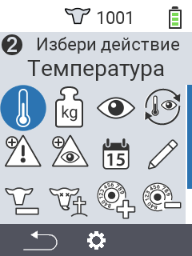
    

    

      

        <h3>Теглене</h3>
      

      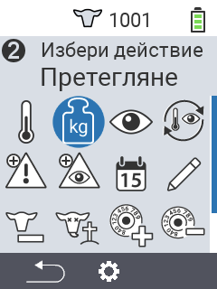
    

    

      

        <h3>Оценка</h3>
      

      
    

    

      

        <h3>Поредица от действия</h3>
      

      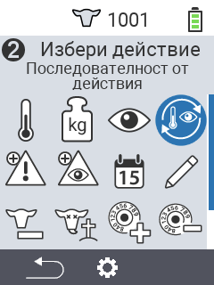
    

    

      

        <h3>Аларма</h3>
      

      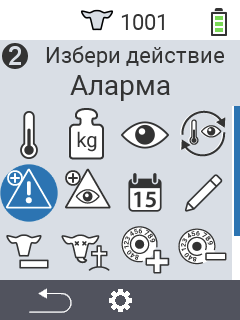
    

    

      

        <h3>На стража</h3>
      

      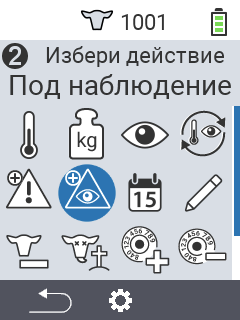
    

    

      

        <h3>История на животното</h3>
      

      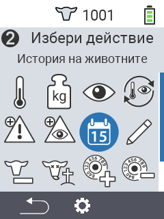
    

    

      

        <h3>Редактиране</h3>
      

      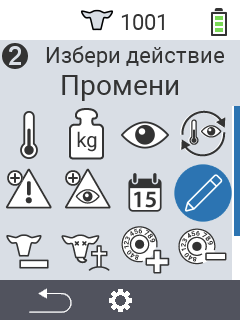
    

    

      

        <h3>Отписване</h3>
      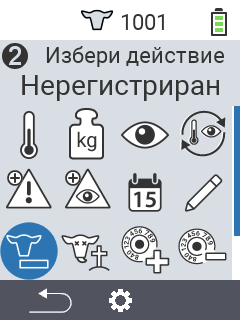
      

    

    

      

        <h3>Загуба на животно</h3>
      

      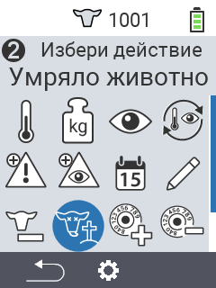
    

    

      

        <h3>Свързване на транспондер</h3>
      

      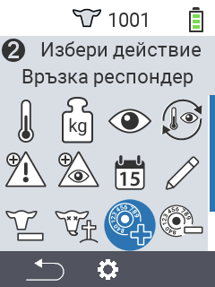
    

    

      

        <h3>Разкачане на транспондер</h3>
      

      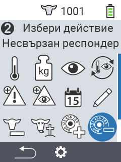
    
      
    

      

        <h3>Свързване на животински ID</h3>
      

      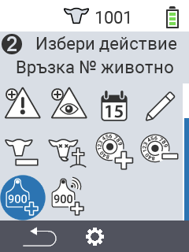
    
   
    

      

        <h3>Свързване на животински ID</h3>
      

      
    
             
  

  <button class="carousel-control-prev" type="button" data-bs-target="#carouselActionsAutoplaying" data-bs-slide="prev" style="left: 0px; top: 37px; height: 320px;">
    
    Предишен
  </button>
  <button class="carousel-control-next" type="button" data-bs-target="#carouselActionsAutoplaying" data-bs-slide="next" style="right: 0px; top: 37px; height: 320px;">
    
    Следващ
  </button>

{}

{}
 

    

    <button type="button" data-bs-target="#carouselListsIndicators" data-bs-slide-to="0" class="active" aria-current="true" aria-label="Аларма"></button>
    <button type="button" data-bs-target="#carouselListsIndicators" data-bs-slide-to="1" aria-label="На наблюдение"></button>
    <button type="button" data-bs-target="#carouselListsIndicators" data-bs-slide-to="2" aria-label="Действие"></button>
    <button type="button" data-bs-target="#carouselListsIndicators" data-bs-slide-to="3" aria-label="Свежи крави"></button>
    <button type="button" data-bs-target="#carouselListsIndicators" data-bs-slide-to="4" aria-label="Сухи крави"></button>
  

    

      

        <h3>Аларма</h3>
      

      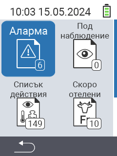
    

    

      

        <h3>На наблюдение</h3>
      

      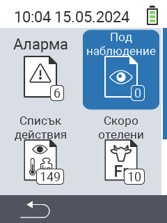
    

    

      

        <h3>Списък за действие</h3>
      
      
      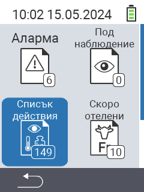
    

    

      

        <h3>Свежи крави</h3>
      

      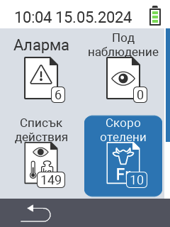
    

    

      

        <h3>Сухи крави</h3>
      

    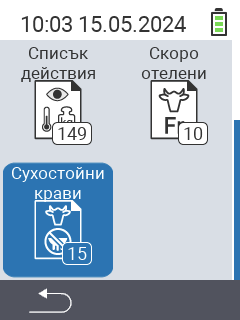
    

  

  <button class="carousel-control-prev" type="button" data-bs-target="#carouselListsAutoplaying" data-bs-slide="prev" style="left: 0px; top: 37px; height: 320px;">
    
    Предишен
  </button>
  <button class="carousel-control-next" type="button" data-bs-target="#carouselListsAutoplaying" data-bs-slide="next" style="right: 0px; top: 37px; height: 320px;">
    
    Следващ
  </button>

{}

{}
 

    

    <button type="button" data-bs-target="#carouselListsIndicators" data-bs-slide-to="0" class="active" aria-current="true" aria-label="Оценка на теглото"></button>
    <button type="button" data-bs-target="#carouselListsIndicators" data-bs-slide-to="1" aria-label="Оценка на температурата"></button>
    <button type="button" data-bs-target="#carouselListsIndicators" data-bs-slide-to="2" aria-label="Оценка на рейтинга"></button>
    <button type="button" data-bs-target="#carouselListsIndicators" data-bs-slide-to="3" aria-label="Оценка на смъртността"></button>
  

    

      

        <h3>Тегло</h3>
      
 
      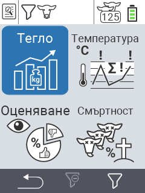
    

    

      

        <h3>Температура</h3>
      
 
      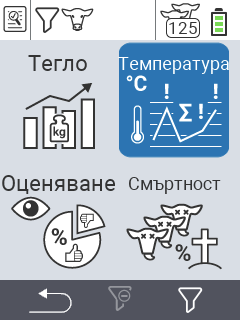
    

    

      

        <h3>Рейтинг</h3>
      
 
      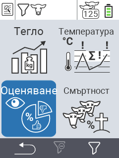
    

    

      

        <h3>Смъртност</h3>
      
 
      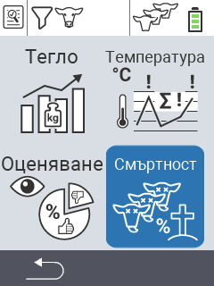
    

  

  <button class="carousel-control-prev" type="button" data-bs-target="#carouselEvaluationAutoplaying" data-bs-slide="prev" style="left: 0px; top: 37px; height: 320px;">
    
    Предишен
  </button>
  <button class="carousel-control-next" type="button" data-bs-target="#carouselEvaluationAutoplaying" data-bs-slide="next" style="right: 0px; top: 37px; height: 320px;">
    
    Следващ
  </button>

{}


{}

Подходящ за няколко **вида животни** на различни **възрасти**

{}


{}
 

 
{}

{}
 

 
{}

{}
 

 
{}



{}

Наши **акценти** за вас

{}


{}
 

 
{}

{}
 
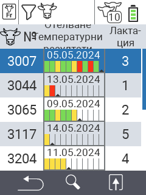
 
{}

{}
 
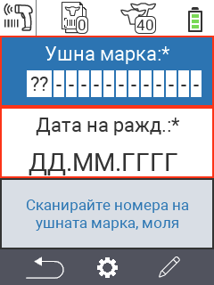
 
{}

{}
 
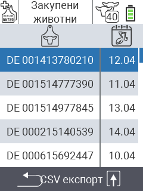
 
{}



{}
Urban в социалните мрежи

{}

{}

{}
{}

{}
{}

{}
{}

{}
{}


