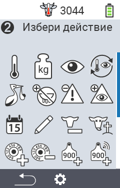
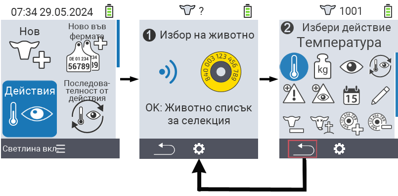
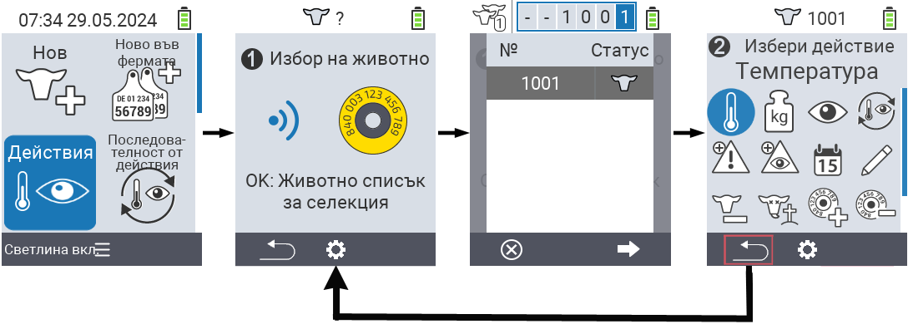

## Налични действия

В зависимост от типа на животното, можете да извършите до 16 различни действия за едно животно.

<map name="workmap">
  <area shape="rect" coords="3,100,60,165" alt="Температура" title="Измерване на температурата на вашите животни&#10;Клик с мишка: отворете документацията" href="/bg/docs/actions/measure-temperature/">
  <area shape="rect" coords="60,100,118,165" alt="Теглене" title="Записване на теглото на вашите животни&#10;Клик с мишка: отворете документацията" href="/bg/docs/actions/record-weight/">
  <area shape="rect" coords="118,100,174,165" alt="Оценка" title="Оценете вашите животни&#10;Клик с мишка: отворете документацията" href="/bg/docs/actions/rating/">
  <area shape="rect" coords="174,100,230,165" alt="Поредица от действия" title="Прилагане и настройка на поредица от действия&#10;Клик с мишка: отворете документацията" href="/bg/docs/chain-of-actions/">
   <area shape="rect" coords="3,165,60,225" alt="Телене" title="Регистриране на телене&#10;Клик с мишка: отворете документацията" href="/bg/docs/actions/calving/">
   <area shape="rect" coords="60,165,120,225" alt="Пресушаване" title="Пресушаване на крава или добавяне към списъка със свежи крави&#10;Клик с мишка: отворете документацията" href="/bg/docs/actions/dry-off/">
   <area shape="rect" coords="120,165,175,225" alt="Аларма" title="Добавяне и премахване на животни от списъка с аларми&#10;Клик с мишка: отворете документацията" href="/bg/docs/actions/alarm/">
   <area shape="rect" coords="175,165,230,225" alt="Под наблюдение" title="Поставяне на животни в списъка за наблюдение или премахването им&#10;Клик с мишка: отворете документацията" href="/bg/docs/actions/on-watch/">
   <area shape="rect" coords="3,225,60,280" alt="История на животното" title="Преглед на историята на животното&#10;Клик с мишка: отворете документацията" href="/bg/docs/actions/animal-history/">
   <area shape="rect" coords="60,225,120,280" alt="Редактиране" title="Редактиране на данните на избраното животно&#10;Клик с мишка: отворете документацията" href="/bg/docs/actions/edit/">
   <area shape="rect" coords="120,225,175,280" alt="Отписване" title="Отписване на животно&#10;Клик с мишка: отворете документацията" href="/bg/docs/actions/unregister/">
   <area shape="rect" coords="175,225,230,280" alt="Загуба на животно" title="Регистриране на загуба на животно&#10;Клик с мишка: отворете документацията" href="/bg/docs/actions/animal-loss/">
   <area shape="rect" coords="3,280,60,337" alt="Свързване на транспондер" title="Присвояване на транспондер на животно&#10;Клик с мишка: отворете документацията" href="/bg/docs/actions/link-transponder/">
   <area shape="rect" coords="55,280,120,337" alt="Разкачане на транспондер" title="Премахване на връзката с транспондера на животно&#10;Клик с мишка: отворете документацията" href="/bg/docs/actions/unlink-transponder/">
   <area shape="rect" coords="120,280,175,337" alt="Ръчно свързване на идентификационен номер на животно" title="Присвояване на национален идентификационен номер на животно, което няма национален идентификационен номер&#10;Клик с мишка: отворете документацията" href="/bg/docs/actions/link-animal-id/#link-animal-id">
   <area shape="rect" coords="175,280,230,337" alt="Свързване на идентификационен номер на животно със сканиране" title="Присвояване на национален идентификационен номер на животно, което няма национален идентификационен номер&#10;Клик с мишка: отворете документацията" href="/bg/docs/actions/link-animal-id/#link-animal-id-with-electronic-ear-tag-scan">

<area shape="rect" coords="100,340,140,375" alt="Настройки" title="Достъп до настройките&#10;Клик с мишката: към документацията" href="/bg/docs/actions/setting/">
</map>

{}
Всяко действие се идентифицира чрез символ. Преместете показалеца на мишката върху символ в графиката по-долу и го задръжте за момент. Ще се появи подсказка, представяща информация за съответното действие. Ако кликнете върху някой от символите, ще бъдете пренасочени към описание на съответното действие.
{}

## Обща процедура

В менюто  `` можете по всяко време да изберете следващото животно, без да напускате менюто Действия. За да изберете следващото животно, процедирайте както следва:

1. Изберете менюто  `` на главния екран на вашето устройство VitalControl и натиснете бутона ``.

2. Сканирайте животно с помощта на транспондера или изберете животно от списъка. Потвърдете с `` и изберете животно с помощта на бутоните със стрелки △ ▽. Потвърдете с ``.

3. Отваря се подменю, в което ще намерите икони за множество действия с животни. Използвайте бутоните със стрелки, за да изберете желаното действие и стартирайте действието с натискане на бутона ``. В зависимост от избраното действие ще се появи един или повече екрани или изскачащ прозорец.

4. Ако желаете, сега можете да изберете и изпълните друго действие за текущото животно.

5. След като сте извършили желаните действия за животното, върнете се към стъпка 2 'Избор на животно'. За това натиснете левия бутон `F1` под символа `` в долния ляв ъгъл на футъра.

6. Прозорецът от стъпка две отново ще се отвори автоматично и можете да изберете следващото животно или да се върнете в главното меню, като натиснете бутона `F1` под символа ``.



{}

{}
{}

{}


Please paste the Markdown content you would like translated into Bulgarian.
