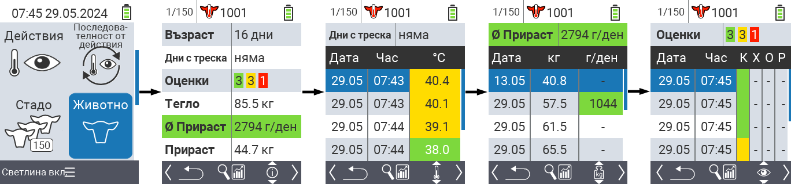
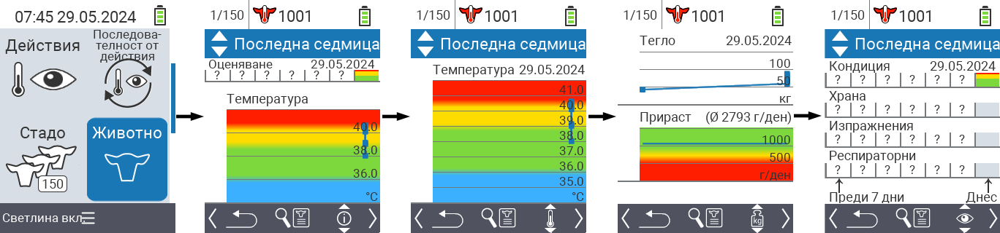
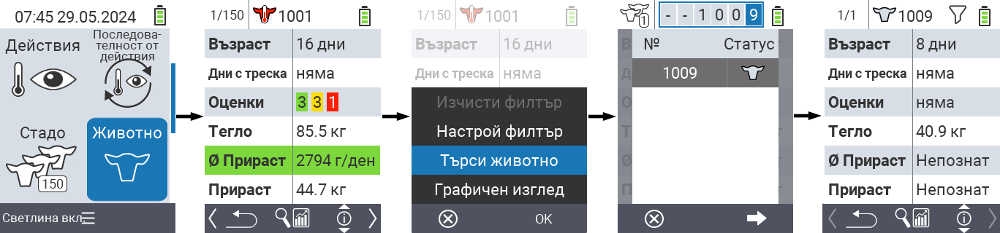
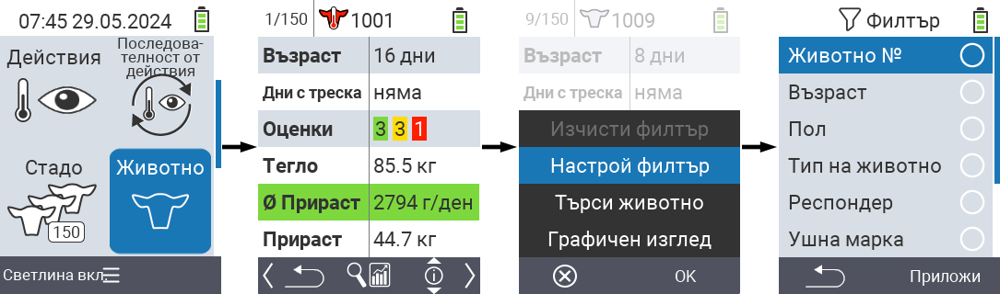

## Животно

Функцията за отделно животно ви позволява да видите важна информация за тегло, температура и оценка за всяко отделно животно. Винаги имате възможността да показвате информацията като графика или като списък. За да използвате функцията за единично животно, процедирайте по следния начин:

1. На главния екран на вашето устройство VitalControl изберете менюто  `Животно` и натиснете бутона `OK`.

2. Отваря се преглед на най-важната информация за животните. Горният край на екрана ви показва кое животно в момента разглеждате. Използвайте клавиша `F3`, за да избирате между информация за животните , температура , тегло   и оценка .

{}
В рамките на всяко показване на информация имате възможност да [търсите животно](#search-animal), да задавате [филтър](#set-filter) и да превключвате към [графичен изглед](#set-graphical-view).
Можете също така да превключвате между отделните животни по всяко време, използвайки стрелките ◁ ▷.
{}

### Задаване на графичен изглед

1. Натиснете горния среден бутон `On/Off` , за да отворите изскачащо меню. В това меню можете да избирате между функциите `Задай филтър`, `Търсене на животно` или `Графичен изглед`.

2. Изберете `Графичен изглед` със стрелките △ ▽ и потвърдете с `OK`.

### Търсене на животно

1. Натиснете горния среден бутон `On/Off`  за да отворите изскачащо меню. В това меню можете да избирате между функциите `Set filter`, `Search animal` или `Graphical view`.

2. Изберете `Search animal` с помощта на стрелките △ ▽ и потвърдете с `OK`.

3. Използвайте стрелките △ ▽ ◁ ▷ за да изберете желания номер на животното и потвърдете с `OK`

### Настройка на филтър

1. Натиснете горния среден бутон `On/Off`  за да отворите изскачащо меню. В това меню можете да избирате между функциите `Set filter`, `Search animal` или `Graphical view`.

2. Изберете `Set filter` с помощта на стрелките △ ▽ и потвърдете с `OK`.
Можете да получите инструкции за употребата на филтъра [тук]().

