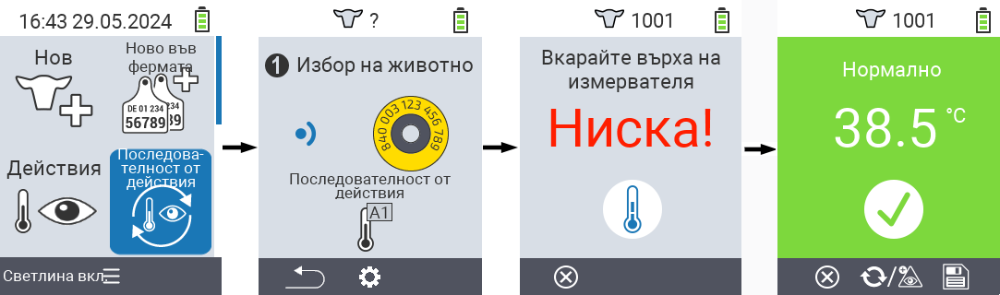
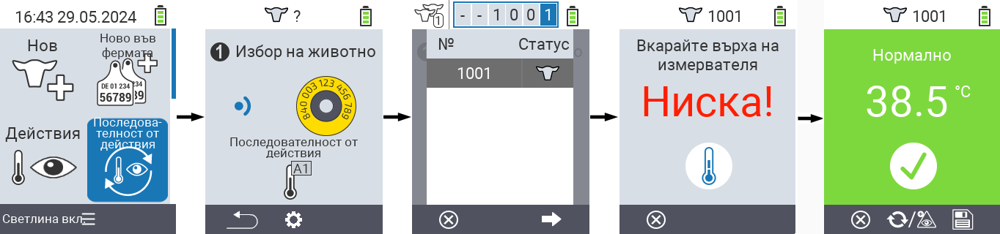
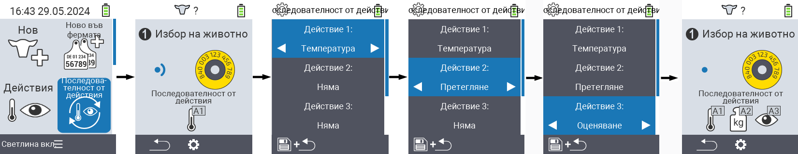

## Поредица от действия {#chain-of-actions}

Поредицата от действия ви позволява автоматично да извършите няколко действия за едно животно едно след друго. Например, можете да изберете действията `` и ``. Ако след това изпълните поредицата от действия, първо можете да вземете температурата на животното и веднага след това да запишете оценката.

### Използване на поредица от действия {#use-chain-of-actions}

1. На главния екран на вашето устройство VitalControl изберете менюто &nbsp;&nbsp; `` и натиснете бутона ``.

2. Сканирайте животно с помощта на транспондера или потвърдете с `` и използвайте стрелките △ ▽ ◁ ▷ за въвеждане на желания идентификационен номер на животното.

3. Поредицата от действия се изпълнява. Щом всички действия в поредицата от действия бъдат извършени, може директно да изберете следващото животно.



{}

{}
{}

{}


### Настройка на поредица от действия {#set-chain-of-actions}

1. На главния екран на вашето устройство VitalControl изберете менюто &nbsp;&nbsp; `` и натиснете бутона ``.

2. Използвайте бутона `F2` &nbsp;&nbsp; (``).

3. Появява се екран за настройки. Използвайте стрелките △ ▽ за избор между изброените действия 1 - 4 (можете да изпълните до четири действия последователно). Използвайте стрелките ◁ ▷ за избор на желаното действие за съответното действие. Запазете настройките с бутона `F1` &nbsp;&nbsp;.

4. Ако искате да рестартирате цялата верига от действия, изберете опцията `` в подменюто, като използвате стрелките △ ▽ и потвърдете с ``.

    

{}
В рамките на отделните действия имате същите настройки, както са описани в главата [Actions](../actions) за всяко отделно действие.
{}

{}
Символите в началния екран на веригата от действия показват кои действия сте задали и в какъв ред.
{}
