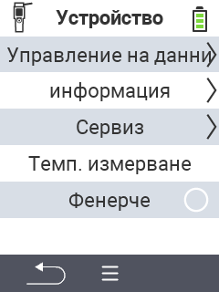

{}
Ако кликнете върху елемент от менюто, ще бъдете пренасочени към описание на съответната функция.
{}

<map name="workmap">
  <area shape="rect" coords="2,40,238,80" alt="Управление на данни" title="Извършване на резервни копия на данни, експортиране на данните и рестартиране на устройството&#10;Клик с мишка: отвори документация" href="/bg/docs/device/data-management/">
  <area shape="rect" coords="2,80,238,120" alt="Информация" title="Преглед на важна софтуерна и хардуерна информация&#10;Клик с мишка: отвори документация" href="/bg/docs/device/info/">
  <area shape="rect" coords="2,120,238,160" alt="Обслужване" title="Проверка на драйверите на устройството, актуализация на фърмуера и извършване на тест за обхват&#10;Клик с мишка: отвори документация" href="/bg/docs/device/service/">
  <area shape="rect" coords="2,160,238,200" alt="Измерване на температура" title="Тестване на измерването на температурата на устройството&#10;Клик с мишка: отвори документация" href="/bg/docs/device/temperature-measurement/">
  <area shape="rect" coords="2,200,238,240" alt="Фенерче" title="Включване или изключване на светлината на устройството VitalControl&#10;Клик с мишка: отвори документация" href="/bg/docs/device/flashlight/">

  <area shape="rect" coords="2,282,97,318" alt="Назад" title="Връщане назад с едно ниво" href="/bg/docs/menu/mainmenu/">
</map>
