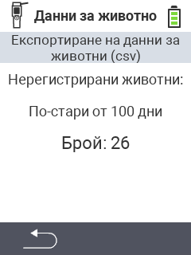

<map name="workmap">
  <area shape="rect" coords="2,40,238,80" alt="Експортиране на данни за животни (csv)" title="Експортирайте вашите данни за животни&#10;Клик с мишка: отворете документацията" href="/bg/docs/data-export/usb-drive/">

  <area shape="rect" coords="2,80,238,200" alt="Отписване на животни" title="Посочете възрастта, от която животните трябва да бъдат отписани&#10;Клик с мишка: отворете документацията" href="/bg/docs/device/data-management/animal-data/unregister-animal/">

  <area shape="rect" coords="2,282,120,319" alt="Назад" title="Тук можете да намерите цялата информация и инструкции за експортиране на данни за животни&#10;Клик с мишка: отворете документацията" href="/bg/docs/device/data-management/">
</map>
