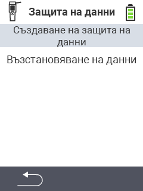

<map name="workmap">
  <area shape="rect" coords="2,40,238,80" alt="Създаване на резервно копие" title="Инструкциите за създаване на резервно копие могат да бъдат намерени тук&#10;Клик с мишка: отвори документация" href="/bg/docs/backup/backup/">

  <area shape="rect" coords="2,80,238,120" alt="Възстановяване на резервно копие" title="Инструкциите за възстановяване на резервно копие могат да бъдат намерени тук&#10;Клик с мишка: отвори документация" href="/bg/docs/backup/restore/">

  <area shape="rect" coords="2,282,120,319" alt="Назад" title="Връщане назад с едно ниво&#10;Клик с мишка: отвори документация" href="/bg/docs/device/data-management/">
</map>
