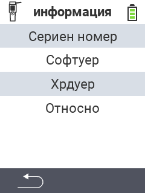

{}
Ако кликнете върху елемент от менюто, ще бъдете пренасочени към описание на съответната функция.
{}

<map name="workmap">
  <area shape="rect" coords="2,40,238,80" alt="Сериен номер" title="За да извлечете серийния номер на вашето устройство кликнете тук&#10;Mausklick: zur Dokumentation" href="/bg/docs/device/info/serial-number/">
  <area shape="rect" coords="2,80,238,120" alt="Софтуер" title="Инструкциите за преглед на вашата версия на софтуера можете да намерите тук&#10;Mausklick: zur Dokumentation" href="/bg/docs/firmware/versions/">
  <area shape="rect" coords="2,120,238,160" alt="Хардуер" title="За достъп до информацията за хардуера на вашето устройство кликнете тук&#10;Mausklick: zur Dokumentation" href="/bg/docs/device/info/hardware/">
  <area shape="rect" coords="2,160,238,200" alt="За" title="Извикайте информация за доставчика&#10;Mausklick: zur Dokumentation" href="/bg/docs/device/info/about/">

  <area shape="rect" coords="2,282,120,319" alt="Назад" title="Скочете обратно на ниво&#10;Mouse click: open documentation" href="/bg/docs/device/">
</map>
