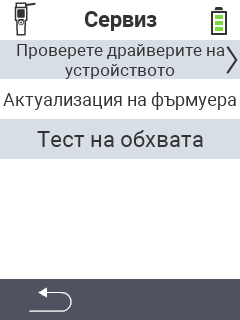

{}
Ако кликнете върху елемент от менюто, ще бъдете пренасочени към описание на съответната функция.
{}

<map name="workmap">
  <area shape="rect" coords="2,42,238,82" alt="Проверка на драйверите на устройството" title="Инструкциите за проверка на драйверите на вашето устройство можете да намерите тук&#10;Клик с мишка: отворете документацията" href="/bg/docs/diagnosis/hardware/">
  <area shape="rect" coords="2,82,238,122" alt="Актуализация на фърмуера" title="Инструкциите за актуализация на фърмуера можете да намерите тук&#10;Клик с мишка: отворете документацията" href="/bg/docs/firmware/update/">
  <area shape="rect" coords="2,122,238,162" alt="Тест на обхвата" title="Инструкциите за извършване на тест на обхвата можете да намерите тук&#10;Клик с мишка: отворете документацията" href="/bg/docs/diagnosis/rfid-scan/">

  <area shape="rect" coords="2,282,120,319" alt="Назад" title="Върнете се назад с едно ниво&#10;Клик с мишка: отворете документацията" href="/bg/docs/device/">
</map>
