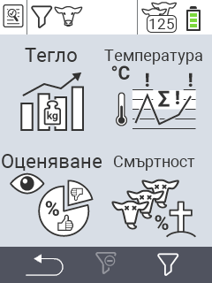

{}
Ако кликнете върху елемент от менюто, ще бъдете пренасочени към описание на съответната функция.
{}

<map name="workmap">
  <area shape="rect" coords="3,40,116,160" alt="Тегло" title="Оценете вашите съхранени данни в секцията за Тегло&#10;Клик с мишка: отворете документацията" href="/bg/docs/evaluation/weight/">
  <area shape="rect" coords="3,160,116,279" alt="Оценка" title="Оценете вашите съхранени данни в секцията за Оценка&#10;Клик с мишка: отворете документацията" href="/bg/docs/evaluation/rating/">

  <area shape="rect" coords="116,40,238,160" alt="Температура" title="Оценете вашите съхранени данни в секцията за Температура&#10;Клик с мишка: отворете документацията" href="/bg/docs/evaluation/temperature/">
  <area shape="rect" coords="116,160,238,279" alt="Смъртност" title="Оценете вашите съхранени данни в секцията за Смъртност&#10;Клик с мишка: отворете документацията" href="/bg/docs/evaluation/mortality/">

  <area shape="rect" coords="150,282,238,319" alt="Филтър" title="Задайте филтър&#10;Клик с мишка: към документацията" href="/bg/docs/filter">
  <area shape="rect" coords="2,282,95,319" alt="Назад" title="Скочете назад с едно ниво&#10;Клик с мишка: към документацията" href="/bg/docs/menu/mainmenu/">
</map>
