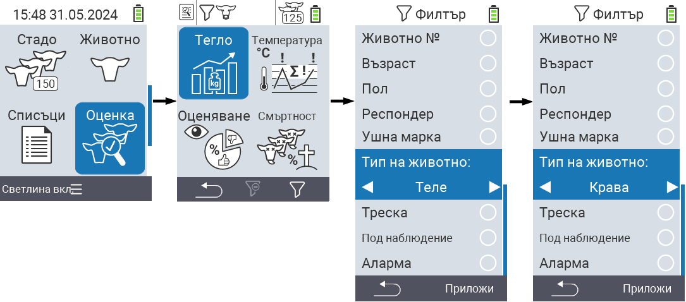
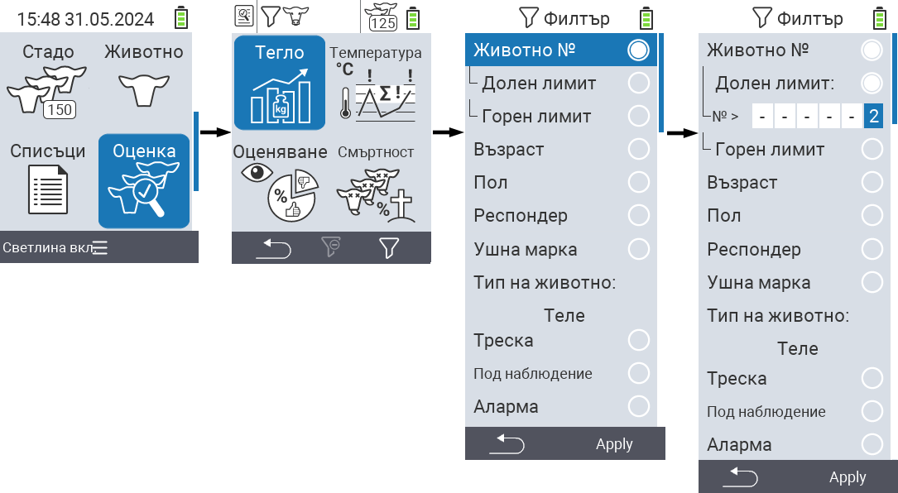
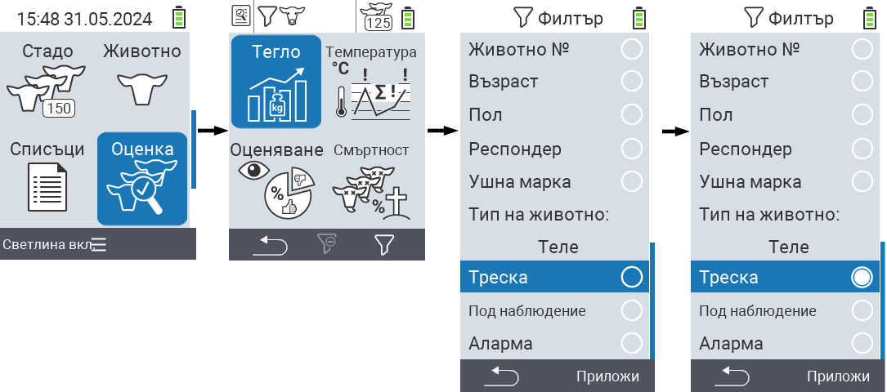

## Прилагане на филтри {#applying-filters}

{}
Филтърът ви помага да извършите селекция, използвайки критерии за филтриране в менюто ``, `` и `` на устройството VitalControl. Щом приложите филтър, на върха на екрана се появяват символи за различните критерии за филтриране. Тези символи се използват, за да ви помогнат да разберете дали и кои критерии за филтриране са активирани. Например, ако зададете филтъра `` на мъжки, устройството ще използва само мъжки животни. Например, ако активирате също филтъра ``, устройството използва само мъжки животни, които са в списъка за наблюдение.
{}

За да създадете филтър в оценките, процедирайте както следва:

1. В подменюто, принадлежащо към главния меню пункт  `` натиснете клавиша `F3`  веднъж. В подменюто, принадлежащо към главните меню пунктове  `` и  ``, трябва да натиснете клавиша два пъти.

2. Отваря се подменю, в което можете да зададете всички опции за филтриране. Можете да филтрирате по ``, ``, ``, ``, ``, ``, ``, `` и ``.

3. За филтрите ``, ``, `` и `` се придвижете до съответната област и потвърдете с ``. Използвайте стрелките ◁ ▷, за да посочите желаната настройка. Използвайте клавиша `F3` ``, за да поставите избраната настройка на място. За да отхвърлите промените във филтъра, натиснете клавиша `F1` &nbsp;&nbsp;.

4. За филтрите `` и `` изберете съответния критерий и потвърдете с ``. Ще ви бъдат показани долна и горна граница. Навигирайте до желаната граница с помощта на стрелките △ ▽ и потвърдете с натискане на `` два пъти. Сега можете да зададете желаното число с помощта на стрелките ◁ ▷ и стрелките △ ▽. След като всички настройки са коректни, натиснете отново ``, за да излезете от режима на настройка и приложите избраните филтри с клавиш `F3` ``. С клавиш `F1` &nbsp;&nbsp;, можете да отхвърлите промените си, ако желаете.

5. За филтрите ``, `` и `` има възможност да се деактивират или активират. За това изберете съответния филтър и потвърдете с ``. Филтърът сега е активен. Потвърдете отново с ``, за да деактивирате филтъра.

6. След като сте задали всички филтри, използвайте клавиш `F3` ``, за да поставите дефинираните филтри на място или натиснете клавиш `F1`  за да отхвърлите промените на филтрите.
