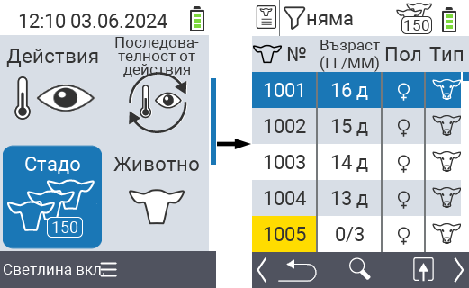
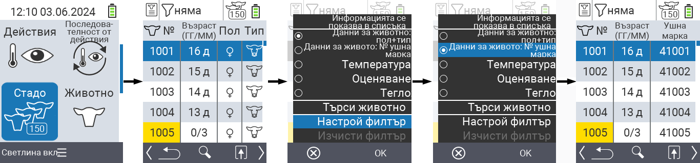
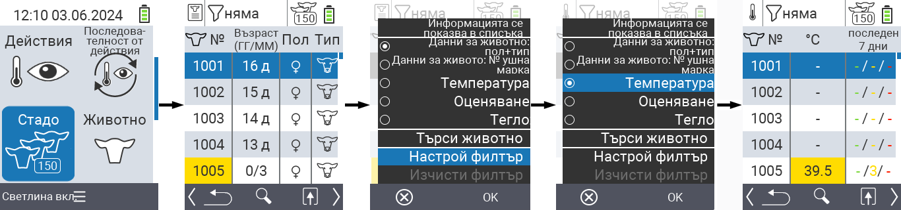
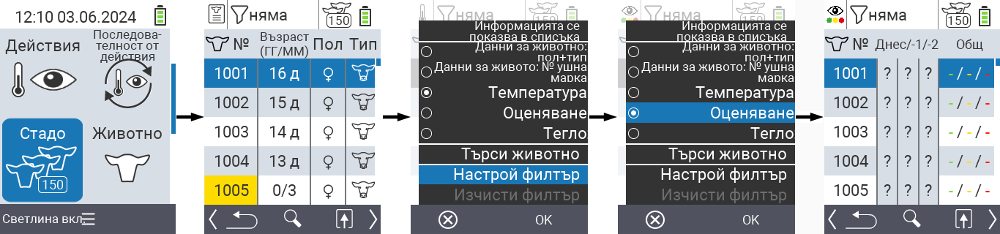
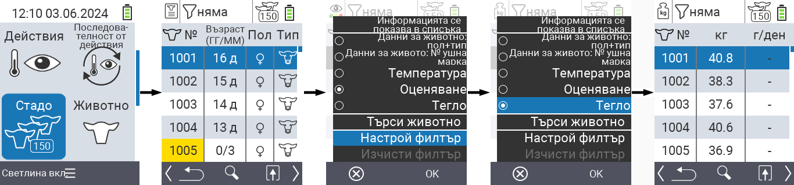
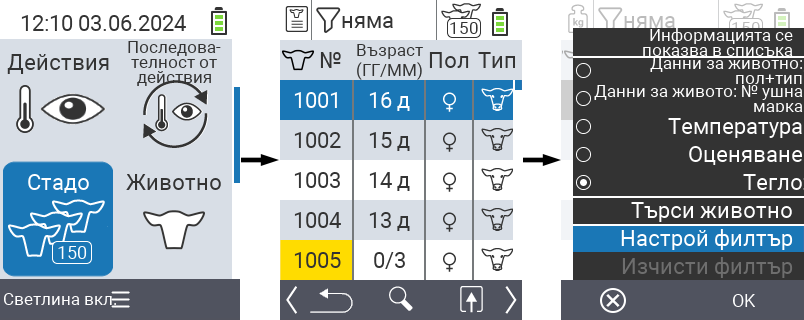
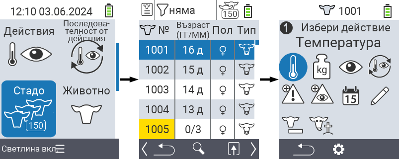

## Стадо

В менюто Стадо можете да видите цялото си стадо, да търсите отделни животни и да показвате важна информация. Имате следните възможности:

- Вижте [данни за животните](#view-animal-data)
- Вижте [данни за температурата](#display-temperature)
- Вижте [данни за оценката](#view-rating)
- Вижте [данни за теглото](#view-rating)
- [Търсене на животно](#search-animal)
- Задайте [филтър](#set-filter)
- [Действия](#call-action-menu)

### Подготвителни стъпки

1. На главния екран на вашето устройство VitalControl изберете менюто  `Стадо` и натиснете бутона `OK`.

2. Отваря се обзорът на вашето стадо.

    

### Вижте данни за животните

1. Изпълнете подготвителните стъпки.

2. Използвайте клавиша `F3` &nbsp;&nbsp; за да извикате попъп меню, което изброява категориите информация, които могат да бъдат показани за списъка със стадото. Използвайте стрелките △ ▽ за да подчертаете линията `Данни за животните: пол + вид` или `Данни за животните: N0 ушна марка` и изберете тази категория, като натиснете централния бутон `OK` или клавиша `F3` `OK`. Двете опции за избор се различават по показването на информационната лента.

3. Данните за животните сега ще бъдат показани като съдържание на списъка със стадото.

4. Алтернативно, можете да използвате стрелките ◁ ▷ за да превключвате между различните опции за показване.

    

{}
По подразбиране данните за животните се показват първи. Само когато имате показано теглото, например, трябва отново да зададете показването на данните за животните.
{}

### Показване на температура

1. Изпълнете подготвителните стъпки.

2. Използвайте клавиша `F3` &nbsp;&nbsp; за да активирате изскачащо меню, което изброява категориите информация, които могат да бъдат показани за списъка със стадото. Използвайте стрелките △ ▽ за да подчертаете линията `Temperature` и изберете тази категория като натиснете централния бутон `OK` или клавиша `F3` `OK`.

3. Данните за температурата сега ще бъдат показани като съдържание на списъка със стадото.

4. Като алтернатива, можете да използвате стрелките ◁ ▷ за да превключвате между различните опции за показване.

    

### Преглед на оценка

1. Изпълнете подготвителните стъпки.

2. Използвайте клавиша `F3` &nbsp;&nbsp; за да активирате изскачащо меню, което изброява категориите информация, които могат да бъдат показани за списъка със стадото. Използвайте стрелките △ ▽ за да подчертаете линията `Rating` и изберете тази категория като натиснете централния бутон `OK` или клавиша `F3` `OK`.

3. Данните за оценката сега ще бъдат показани като съдържание на списъка със стадото.

4. Като алтернатива, можете да използвате стрелките ◁ ▷ за да превключвате между различните опции за показване.

    

### Показване на тегло

1. Изпълнете подготвителните стъпки.

2. Използвайте клавиша `F3` &nbsp;&nbsp; за да активирате изскачащо меню, което изброява категориите информация, които могат да бъдат показани за списъка със стадото. Използвайте стрелките △ ▽ за да подчертаете линията `Weight` и изберете тази категория като натиснете централния бутон `OK` или клавиша `F3` `OK`.

3. Данните за теглото сега ще бъдат показани като съдържание на списъка със стадото.

4. Като алтернатива, можете да използвате стрелките ◁ ▷ за да превключвате между различните опции за показване.

    

### Търсене на животно

1. Изпълнете подготвителните стъпки.

2. Използвайте клавиша `F3` &nbsp;&nbsp; за да активирате изскачащо меню, което изброява различни опции. Използвайте стрелките △ ▽ за да подчертаете функцията `Search animal` и активирайте функцията за търсене като натиснете централния бутон `OK` или клавиша `F3` `OK`. Като алтернатива, можете да използвате бутона `On/Off`  веднага след първата стъпка.

3. Използвайте стрелките △ ▽ ◁ ▷ за въвеждане на желания номер на животно и потвърдете с `OK`.

    

### Задаване на филтър

1. Изпълнете подготвителните стъпки.

2. Използвайте клавиша `F3` &nbsp;&nbsp; за да извикате попъп меню, което изброява различни опции. Използвайте стрелките △ ▽ за да подчертаете функцията `Задаване на филтър` и активирайте функцията за филтриране като натиснете централния клавиш `OK` или клавиша `F3` `OK`.

3. Как да приложите филтъра може да намерите [тук]().

    

### Извикване на меню за действия

Винаги имате възможността да извикате менюто за действия за животно.

1. Изпълнете подготвителните стъпки.

2. Изберете животно от списъка със стрелките △ ▽ и потвърдете с `OK`.

3. Менюто за действия е сега отворено. Как да използвате това може да намерите [тук](../actions).

4. Върнете се към списъка със стадото с клавиша `F3`.

    
