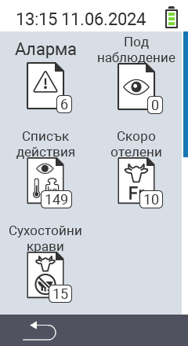

{}
Ако кликнете върху елемент от менюто, ще бъдете пренасочени към описание на съответната функция.
{}

<map name="workmap">
  <area shape="rect" coords="3,40,116,160" alt="Списък с аларми" title="Разгледайте вашия списък с аларми&#10;Клик с мишка: отворете документацията" href="/bg/docs/lists/alarm/">
  <area shape="rect" coords="3,160,116,280" alt="Списък с действия" title="Разгледайте вашия списък с действия.&#10;Клик с мишка: отворете документацията" href="/bg/docs/lists/actions/">
  <area shape="rect" coords="3,280,116,399" alt="Списък със сухи крави" title="Разгледайте вашия списък със сухи крави&#10;Клик с мишка: отворете документацията" href="/bg/docs/lists/dry-cows/">

  <area shape="rect" coords="116,40,230,160" alt="Списък за наблюдение" title="Разгледайте вашия списък за наблюдение&#10;Клик с мишка: отворете документацията" href="/bg/docs/lists/on-watch/">
  <area shape="rect" coords="116,160,230,280" alt="Свежи крави" title="Разгледайте вашия списък със свежи крави&#10;Клик с мишка: отворете документацията" href="/bg/docs/lists/fresh-cows/">

  <area shape="rect" coords="2,401,115,438" alt="Назад" title="Върнете се едно ниво назад" href="/bg/docs/menu/mainmenu/">
</map>

