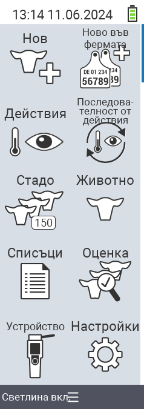

{}
Ако кликнете върху елемент от менюто, ще бъдете пренасочени към описание на съответната функция.
{}

<map name="workmap">
  <area shape="rect" coords="3,40,116,160" alt="Нов" title="Създаване на нови животни&#10;Клик с мишка: отвори документация" href="/en/docs/new/">
  <area shape="rect" coords="3,160,116,280" alt="Действия" title="Действия с животни&#10;Клик с мишка: отвори документация" href="/en/docs/actions/">
  <area shape="rect" coords="3,280,116,400" alt="Стадо" title="Меню стадо&#10;Клик с мишка: отвори документация" href="/en/docs/herd/">
  <area shape="rect" coords="3,400,116,520" alt="Списъци" title="Списъци с животни&#10;Клик с мишка: отвори документация" href="/en/docs/lists/">
  <area shape="rect" coords="3,520,116,634" alt="Устройство" title="Устройство&#10;Клик с мишка: отвори документация" href="/en/docs/device/">

  <area shape="rect" coords="116,40,230,160" alt="Нов на фермата" title="Достъп на животни&#10;Клик с мишка: отвори документация" href="/en/docs/new-on-farm/">
  <area shape="rect" coords="116,160,230,280" alt="Поредица от действия" title="Поредица от действия&#10;Клик с мишка: отвори документация" href="/en/docs/chain-of-actions/">
  <area shape="rect" coords="116,280,230,400" alt="Животно" title="Животно&#10;Клик с мишка: отвори документация" href="/en/docs/animal/">
  <area shape="rect" coords="116,400,230,520" alt="Оценка" title="Оценка&#10;Клик с мишка: отвори документация" href="/en/docs/evaluation/">
  <area shape="rect" coords="116,520,230,634" alt="Настройки" title="Настройки&#10;Клик с мишка: отвори документация" href="/en/docs/settings/">
</map>
