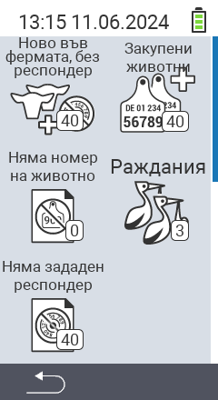

{}
Ако кликнете върху елемент от менюто, ще бъдете пренасочени към описание на съответната функция.
{}

<map name="workmap">
  <area shape="rect" coords="3,40,116,160" alt="Ново на фермата, без транспондер" title="Тук можете да присвоите транспондер на нови животни без транспондер&#10;Клик с мишка: отворете документацията" href="/bg/docs/new-on-farm/new-no-transponder/">
  <area shape="rect" coords="3,160,116,280" alt="Не е присвоен национален идентификационен номер на животното" title="Тук можете да видите всички животни, на които все още не е присвоен национален идентификационен номер и да присвоите такъв&#10;Клик с мишка: отворете документацията" href="/bg/docs/new-on-farm/no-national-animal-id-assigned/">
  <area shape="rect" coords="3,280,116,399" alt="Не е присвоен транспондер" title="Тук можете да видите всички животни, на които все още не е присвоен транспондер и да им присвоите транспондер&#10;Клик с мишка: отворете документацията" href="/bg/docs/new-on-farm/no-transponder-assigned/">

  <area shape="rect" coords="116,40,230,160" alt="Купени животни" title="Тук можете да видите вашите текущи покупки и да експортирате данните&#10;Клик с мишка: отворете документацията" href="/bg/docs/new-on-farm/purchased-animals/">
  <area shape="rect" coords="116,160,230,280" alt="Раждания" title="Тук можете да видите вашите раждания и да създадете файл за експорт&#10;Клик с мишка: отворете документацията" href="/bg/docs/new-on-farm/births/">
  <area shape="rect" coords="1,401,100,439" alt="Назад" title="Връщане назад с едно ниво&#10;Клик с мишка: към документацията" href="/bg/docs/menu/mainmenu/">
</map>
