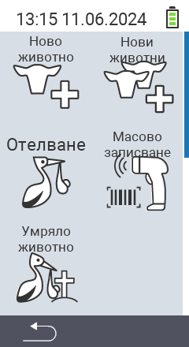

Чрез основния пункт в менюто  `` влизате в подменю, където се представят 5 подпункта за избор:

<map name="workmap">
  <area shape="rect" coords="3,40,116,160" alt="Ново животно" title="Как да регистрирате ново животно с устройството VitalControl&#10;Клик с мишката: отворете документацията" href="/bg/docs/new/animal/">
  <area shape="rect" coords="3,160,116,280" alt="Телене" title="Как да регистрирате ново телене с устройството VitalControl&#10;Клик с мишката: отворете документацията" href="/bg/docs/new/calving/">
  <area shape="rect" coords="3,280,116,399" alt="Загуба на животно" title="Как да регистрирате загубата на животно с устройството VitalControl&#10;Клик с мишката: отворете документацията" href="/bg/docs/new/animal-loss/">

  <area shape="rect" coords="116,40,230,160" alt="Нови животни" title="Как да създадете няколко нови животни на устройството VitalControl с едно единствено действие&#10;Клик с мишката: отворете документацията" href="/bg/docs/new/animals/">
  <area shape="rect" coords="116,160,230,280" alt="Групово регистриране" title="Използвайте скенер за баркодове за регистрация на различни животни&#10;Клик с мишката: отворете документацията" href="/bg/docs/new/bulk-recording/">

  <area shape="rect" coords="1,401,100,439" alt="Назад" title="Връщане назад с едно ниво&#10;Клик с мишката: към документацията" href="/bg/docs/menu/mainmenu/">
</map>

{}
Всяко подменю има своя собствена икона. Преместете показалеца на мишката върху икона в графиката по-горе и го задръжте за момент. Ще се появи подсказка, показваща информация за избрания подпункт от менюто. Ако кликнете върху някоя от иконите, ще бъдете пренасочени към описание на избрания подпункт от подменюто.
{}
