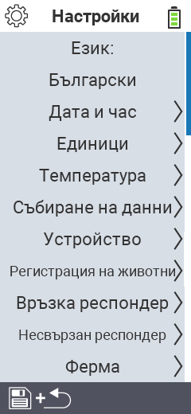

{}
Ако кликнете върху елемент от менюто, ще бъдете пренасочени към описание на съответната функция.
{}

<map name="workmap">
  <area shape="rect" coords="2,40,230,120" alt="Език" title="Задайте и запазете постоянно езика на потребителския интерфейс на вашето устройство VitalControl&#10;Клик с мишката: отворете документацията" href="/bg/docs/settings/language/">
  <area shape="rect" coords="2,120,230,160" alt="Дата & Час" title="Тук задавате датата и часа&#10;Клик с мишката: отворете документацията" href="/bg/docs/settings/datetime/">
  <area shape="rect" coords="2,160,230,200" alt="Мерни единици" title="Тук избирате мерни единици за температура и маса&#10;Клик с мишката: отворете документацията" href="/bg/docs/settings/units/">
  <area shape="rect" coords="2,200,230,240" alt="Температура" title="Задайте настройките за температура за приложението на вашето устройство VitalControl&#10;Клик с мишката: отворете документацията" href="/bg/docs/settings/temperature/">
   <area shape="rect" coords="2,240,230,280" alt="Събиране на данни" title="Тук съхранявате съответната информация за събиране на данни за животните&#10;Клик с мишката: отворете документацията" href="/bg/docs/settings/data-acquisition/">
   <area shape="rect" coords="2,280,230,320" alt="Устройство" title="Тук можете да регулирате различни настройки на устройството&#10;Клик с мишката: към документацията" href="/bg/docs/settings/device/">
   <area shape="rect" coords="2,320,230,360" alt="Регистрация на животни" title="Тук можете да регулирате няколко фабрично зададени стандарта относно регистрацията на нови животни според изискванията на вашата ферма.&#10;Клик с мишката: отворете документацията" href="/bg/docs/settings/animal-registration/">
   <area shape="rect" coords="2,360,230,400" alt="Свързване на транспондер" title="Задайте присвояването на транспондера на вашето устройство VitalControl&#10;Клик с мишката: отворете документацията" href="/bg/docs/settings/transponder-linkage/">
   <area shape="rect" coords="2,400,230,439" alt="Разкачане на транспондер" title="Определете как ще бъде присвоен идентификационният номер на животното след откачане на транспондера&#10;Клик с мишката: отворете документацията" href="/bg/docs/settings/transponder-linkage/">
   <area shape="rect" coords="2,440,230,480" alt="Ферма" title="Запазете постоянно официалния дванадесетцифрен национален идентификационен номер на фермата ви в устройство VitalControl&#10;Клик с мишката: отворете документацията" href="/bg/docs/settings/farm-number/">
   <area shape="rect" coords="2,482,123,519" alt="Назад" title="Върнете се едно ниво назад" href="/bg/docs/menu/mainmenu/">
</map>
