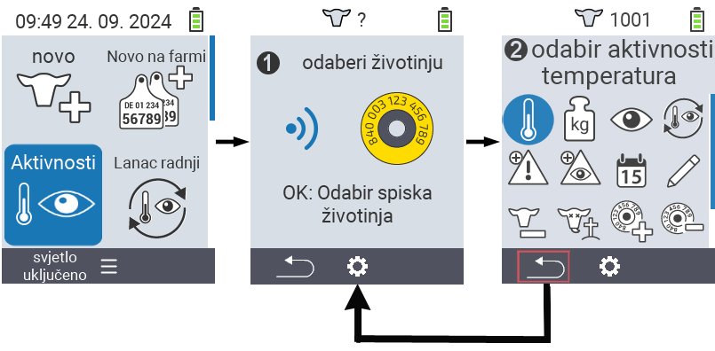
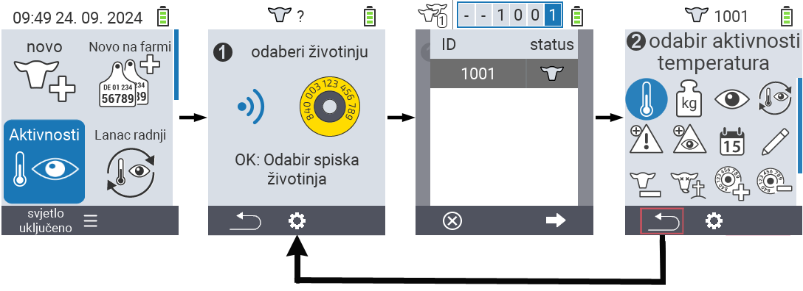

## Dostupne radnje {#available-actions}

Ovisno o vrsti životinje, možete izvršiti do 16 različitih radnji na životinji.

<map name="workmap">
  <area shape="rect" coords="3,100,60,165" alt="Temperatura" title="Izmjerite temperaturu kod vaših životinja&#10;Klik mišem: otvorite dokumentaciju" href="/bs/docs/actions/measure-temperature/">
  <area shape="rect" coords="60,100,118,165" alt="Težina" title="Zabilježite težinu vaših životinja&#10;Klik mišem: otvorite dokumentaciju" href="/bs/docs/actions/record-weight/">
  <area shape="rect" coords="118,100,174,165" alt="Ocjenjivanje" title="Ocijenite vaše životinje&#10;Klik mišem: otvorite dokumentaciju" href="/bs/docs/actions/rating/">
  <area shape="rect" coords="174,100,230,165" alt="Lanac radnji" title="Primjena i postavljanje lanca radnji&#10;Klik mišem: otvorite dokumentaciju" href="/bs/docs/chain-of-actions/">
   <area shape="rect" coords="3,165,60,225" alt="Telenje" title="Registrirajte telenje&#10;Klik mišem: otvorite dokumentaciju" href="/bs/docs/actions/calving/">
   <area shape="rect" coords="60,165,120,225" alt="Sušenje" title="Osušite kravu ili je dodajte na listu svježih krava&#10;Klik mišem: otvorite dokumentaciju" href="/bs/docs/actions/dry-off/">
   <area shape="rect" coords="120,165,175,225" alt="Alarm" title="Dodajte i uklonite životinje s liste alarma&#10;Klik mišem: otvorite dokumentaciju" href="/bs/docs/actions/alarm/">
   <area shape="rect" coords="175,165,230,225" alt="Na oprezu" title="Stavite životinje na listu za praćenje ili ih uklonite&#10;Klik mišem: otvorite dokumentaciju" href="/bs/docs/actions/on-watch/">
   <area shape="rect" coords="3,225,60,280" alt="Istorija životinje" title="Pogledajte istoriju životinje&#10;Klik mišem: otvorite dokumentaciju" href="/bs/docs/actions/animal-history/">
   <area shape="rect" coords="60,225,120,280" alt="Uredi" title="Uredite podatke odabrane životinje&#10;Klik mišem: otvorite dokumentaciju" href="/bs/docs/actions/edit/">
   <area shape="rect" coords="120,225,175,280" alt="Odjaviti" title="Odjavite životinju&#10;Klik mišem: otvorite dokumentaciju" href="/bs/docs/actions/unregister/">
   <area shape="rect" coords="175,225,230,280" alt="Gubitak životinje" title="Registrirajte gubitak životinje&#10;Klik mišem: otvorite dokumentaciju" href="/bs/docs/actions/animal-loss/">
   <area shape="rect" coords="3,280,60,337" alt="Povezivanje transpondera" title="Dodijelite transponder životinji&#10;Klik mišem: otvorite dokumentaciju" href="/bs/docs/actions/link-transponder/">
   <area shape="rect" coords="55,280,120,337" alt="Uklanjanje transpondera" title="Uklonite vezu transpondera sa životinjom&#10;Klik mišem: otvorite dokumentaciju" href="/bs/docs/actions/unlink-transponder/">
   <area shape="rect" coords="120,280,175,337" alt="Ručno povezivanje ID-a životinje" title="Dodijelite nacionalni ID životinji koja nema nacionalni ID&#10;Klik mišem: otvorite dokumentaciju" href="/bs/docs/actions/link-animal-id/#link-animal-id">
   <area shape="rect" coords="175,280,230,337" alt="Povezivanje ID-a životinje skeniranjem" title="Dodijelite nacionalni ID životinji koja nema nacionalni ID&#10;Klik mišem: otvorite dokumentaciju" href="/bs/docs/actions/link-animal-id/#link-animal-id-with-electronic-ear-tag-scan">

<area shape="rect" coords="100,340,140,375" alt="Settings" title="Pozivanje postavki&#10;Klik mišem: na dokumentaciju" href="/bs/docs/actions/setting/">
</map>

{}
Svaka akcija je identificirana simbolom. Pomjerite pokazivač miša preko simbola u donjoj grafici i zadržite ga na trenutak. Pojavit će se tooltip koji prikazuje informacije o odgovarajućoj akciji. Ako kliknete na jedan od simbola, bit ćete preusmjereni na opis odgovarajuće akcije.
{}

## Opći postupak {#general-procedure}

Unutar menija  `` možete odabrati sljedeću životinju u bilo kojem trenutku bez napuštanja stavke menija Akcije. Da biste odabrali sljedeću životinju, postupite na sljedeći način:

1. Odaberite stavku menija  `` na glavnom ekranu vašeg VitalControl uređaja i pritisnite dugme ``.

2. Ili skenirajte životinju pomoću transpondera ili odaberite životinju sa liste. Potvrdite pritiskom na dugme `` i odaberite životinju pomoću strelica △ ▽. Potvrdite sa ``.

3. Otvorit će se podmeni u kojem ćete pronaći ikone za brojne akcije za životinje. Koristite strelice za odabir željene akcije i pokrenite akciju pritiskom na dugme ``. Ovisno o odabranoj akciji, pojavit će se jedan ili više ekrana ili pop-up prozor.

4. Ako želite, sada možete odabrati i izvršiti drugu akciju za trenutnu životinju.

5. Nakon što ste izvršili željenu(e) akciju(e) za životinju, vratite se na korak 2 'Odabir životinje'. Da biste to učinili, pritisnite lijevo dugme `F1` ispod simbola `` u donjem lijevom kutu footera.

6. Prozor iz koraka dva će se automatski ponovo otvoriti i možete odabrati sljedeću životinju ili se vratiti u glavni meni pritiskom na dugme `F1` ispod simbola ``.



{}

{}
{}

{}


