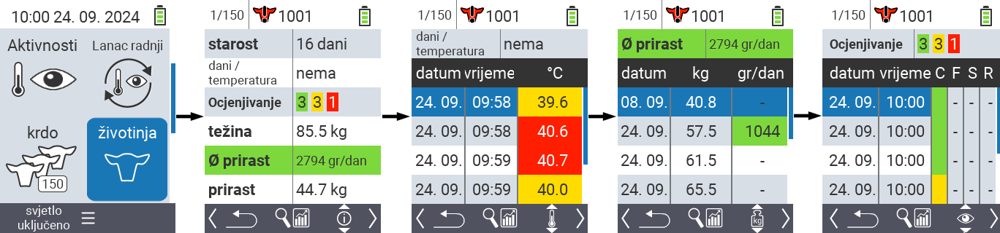
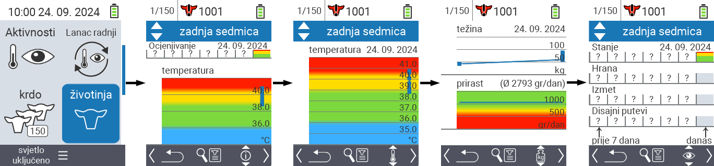
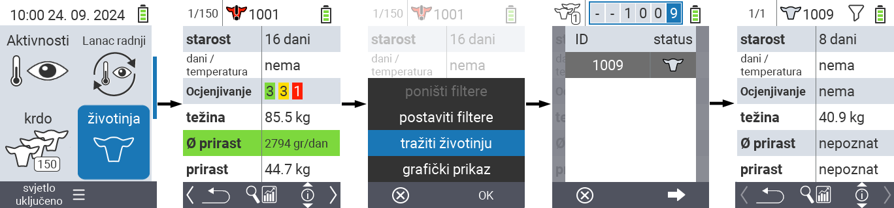
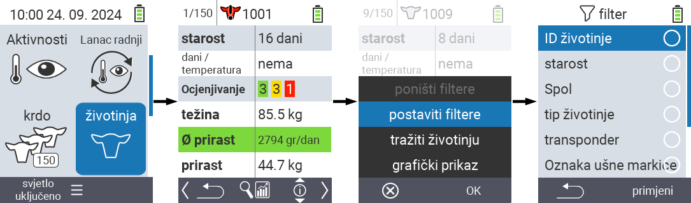

## Životinja {#animal}

Funkcija pojedinačne životinje omogućava vam da vidite važne informacije o težini, temperaturi i ocjeni za svaku pojedinačnu životinju. Uvijek imate mogućnost prikaza informacija kao grafiku ili kao listu. Da biste koristili funkciju pojedinačne životinje, postupite na sljedeći način:

1. Na glavnom ekranu vašeg VitalControl uređaja, odaberite stavku izbornika  `` i pritisnite dugme ``.

2. Otvara se pregled najvažnijih informacija o životinji. Gornji rub ekrana pokazuje vam koju životinju trenutno gledate. Koristite tipku `F3` za odabir između informacija o životinji , temperaturi , težini   i ocjeni .

{}
Unutar svakog prikaza informacija imate mogućnost [pretraživanja životinje](#search-animal), postavljanja [filtera](#set-filter) i prebacivanja na [grafički prikaz](#set-graphical-view).
Također možete u bilo kojem trenutku prebacivati između pojedinačnih životinja koristeći tipke sa strelicama ◁ ▷.
{}

### Postavi grafički prikaz {#set-graphical-view}

1. Pritisnite srednje gornje dugme `On/Off`  kako biste otvorili pop up izbornik. U ovom izborniku možete birati između funkcija ``, ``, ili ``.

2. Odaberite `` pomoću strelica △ ▽ i potvrdite sa ``.

### Pretraga životinje {#search-animal}

1. Pritisnite srednje gornje dugme `On/Off`  kako biste otvorili pop up meni. U ovom meniju možete birati između funkcija ``, `` ili ``.

2. Odaberite `` pomoću strelica △ ▽ i potvrdite sa ``.

3. Koristite strelice △ ▽ ◁ ▷ da odaberete željeni broj životinje i potvrdite sa ``

### Postavljanje filtera {#set-filter}

1. Pritisnite srednje gornje dugme `On/Off`  kako biste otvorili pop up meni. U ovom meniju možete birati između funkcija ``, `` ili ``.

2. Odaberite `` pomoću strelica △ ▽ i potvrdite sa ``.
Upute za korištenje filtera možete pronaći [ovdje]().

