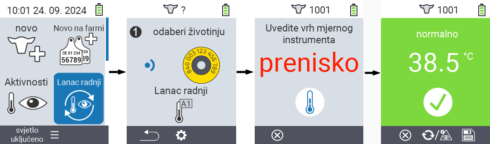
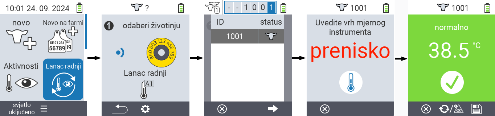
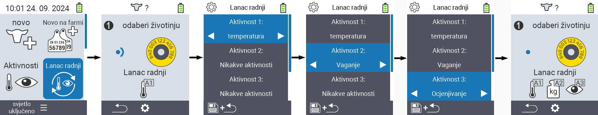

## Lanac akcija {#chain-of-actions}

Lanac akcija vam omogućava da automatski izvršite nekoliko akcija za životinju jednu za drugom. Na primjer, možete odabrati akcije `` i ``. Ako zatim izvršite lanac akcija, možete prvo izmjeriti temperaturu vaše životinje i odmah nakon toga zabilježiti ocjenu.

### Korištenje lanca akcija {#use-chain-of-actions}

1. Na glavnom ekranu vašeg VitalControl uređaja, odaberite stavku izbornika &nbsp;&nbsp; `` i pritisnite dugme ``.

2. Ili skenirajte životinju pomoću transpondera ili potvrdite sa `` i koristite strelice △ ▽ ◁ ▷ za unos željenog ID-a životinje.

3. Lanac akcija se sada izvršava. Čim se sve akcije u lancu akcija izvrše, može se direktno odabrati sljedeća životinja.



{}

{}
{}

{}


### Postavljanje lanca akcija {#set-chain-of-actions}

1. Na glavnom ekranu vašeg VitalControl uređaja, odaberite stavku izbornika &nbsp;&nbsp; `` i pritisnite dugme ``.

2. Koristite dugme `F2` &nbsp;&nbsp; (``).

3. Pojavi se ekran za prekrivanje. Koristite strelice △ ▽ za odabir između navedenih akcija 1 - 4 (možete izvršiti do četiri akcije zaredom). Koristite strelice ◁ ▷ za odabir željene akcije za odgovarajuću akciju. Sačuvajte postavke sa `F1` tipkom &nbsp;&nbsp;.

4. Ako želite resetovati cijeli lanac akcija, odaberite opciju `` u podmeniju koristeći strelice △ ▽ i potvrdite sa ``.

    

{}
Unutar pojedinačnih akcija imate iste opcije postavki kao što je opisano u poglavlju [Akcije](../actions) za svaku pojedinačnu akciju.
{}

{}
Simboli na početnom ekranu lanca akcija pokazuju koje ste akcije postavili i kojim redoslijedom.
{}
