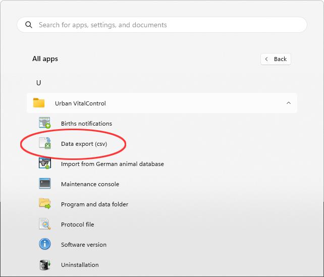

Postupite na sljedeći način kako biste izvezli podatke sa VitalControl uređaja na uređaj za masovno skladištenje vašeg računara:

### Povežite VitalControl sa računarom {#connect-vitalcontrol-to-pc}

1. Povežite VitalControl uređaj sa vašim računarom ili laptopom putem priloženog USB kabla.

   

1. Uvjerite se da je vaš VitalControl uređaj uključen.

### Izvršite izvoz podataka {#perform-data-export}

1. Pritisnite Windows tipku da otvorite Start meni

1. *Samo za Windows 11*: Kliknite na dugme `Sve aplikacije`

1. U listi instaliranih aplikacija, skrolujte do slova `U`. Tamo biste trebali pronaći unos menija `Urban VitalControl`. Ako je potrebno, proširite ovaj unos kako bi se prikazali svi podmeniji.

   {}
Ako ne možete pronaći unos `Urban VitalControl` u vašoj listi aplikacija, možda ćete prvo morati [instalirati](../vcsynchronizer/installation/) softver `VCSynchronizer` na vaš računar.
   {}

1. Kliknite na stavku menija `Izvoz podataka (CVS)`.

   

1. Proces izvoza je započet. Kada se izvoz podataka završi, otvoriće se prozor Explorera koji prikazuje lokalni direktorij sa četiri novo kreirane [izvozne datoteke](../../data-export/export-files/).

   

   {}
  Možete otvoriti svaku od ovih četiri [izvoznih datoteka](../../data-export/export-files/) u programu za proračunske tablice po vašem izboru (kao što su [Microsoft Excel](https://products.office.com/excel) ili [OpenOffice Calc](https://www.openoffice.org/)) i tamo izvršiti naprednu analizu podataka. Kao primjer, prikazan je pogled na tabelu `animals.csv` u programu za proračunske tablice:

  
   {}
