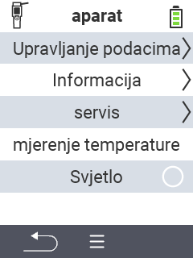

{}
Ako kliknete na stavku izbornika, bit ćete preusmjereni na opis odgovarajuće funkcije.
{}

<map name="workmap">
  <area shape="rect" coords="2,40,238,80" alt="Upravljanje podacima" title="Pokrenite sigurnosne kopije podataka, izvezite svoje podatke i resetirajte uređaj&#10;Klik mišem: otvorite dokumentaciju" href="/bs/docs/device/data-management/">
  <area shape="rect" coords="2,80,238,120" alt="Informacije" title="Pogledajte važne informacije o softveru i hardveru&#10;Klik mišem: otvorite dokumentaciju" href="/bs/docs/device/info/">
  <area shape="rect" coords="2,120,238,160" alt="Servis" title="Provjerite upravljačke programe uređaja, ažurirajte firmware i izvršite test dometa&#10;Klik mišem: otvorite dokumentaciju" href="/bs/docs/device/service/">
  <area shape="rect" coords="2,160,238,200" alt="Mjerenje temperature" title="Testirajte mjerenje temperature vašeg uređaja&#10;Klik mišem: otvorite dokumentaciju" href="/bs/docs/device/temperature-measurement/">
  <area shape="rect" coords="2,200,238,240" alt="Svjetiljka" title="Uključite ili isključite svjetlo na vašem VitalControl uređaju&#10;Klik mišem: otvorite dokumentaciju" href="/bs/docs/device/flashlight/">

  <area shape="rect" coords="2,282,97,318" alt="Nazad" title="Vratite se na prethodni nivo" href="/bs/docs/menu/mainmenu/">
</map>
