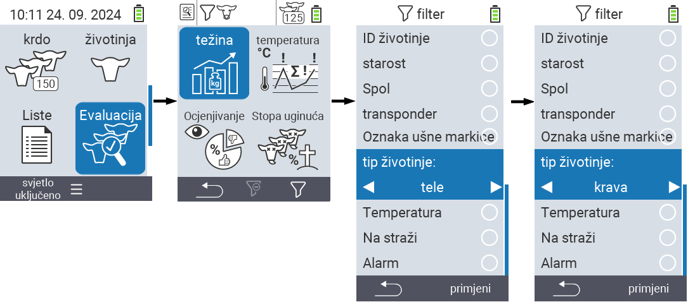
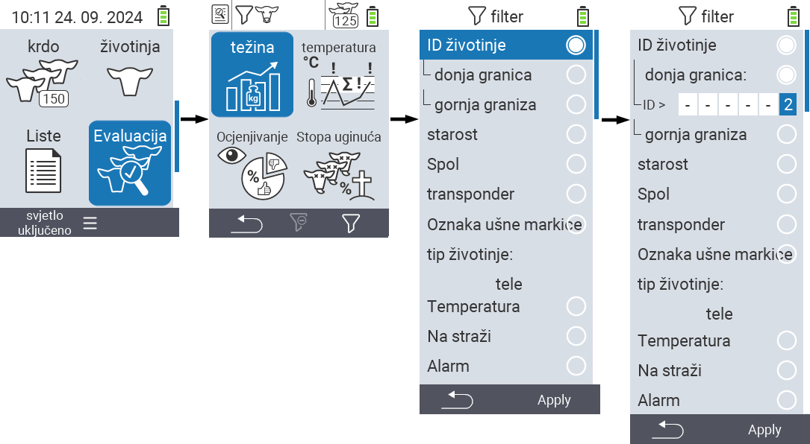
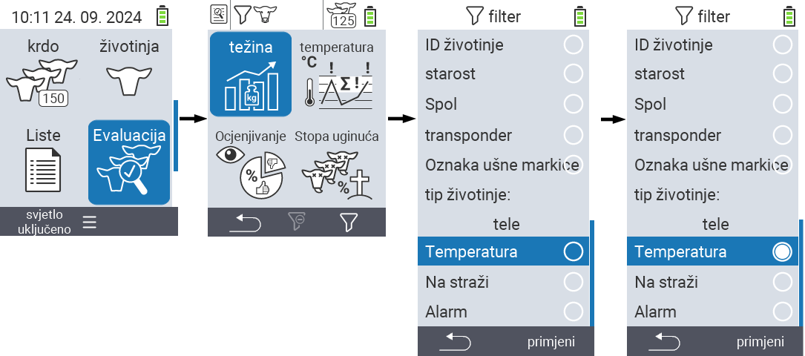

## Primjena filtera {#applying-filters}

{}
Filter vam pomaže da izvršite selekciju koristeći kriterije filtera unutar stavki menija ``, `` i `` uređaja VitalControl. Čim primijenite filter, simboli za različite kriterije filtera pojavljuju se na vrhu ekrana. Ovi simboli vam pomažu da saznate da li su i koji kriteriji filtera aktivirani. Na primjer, ako postavite filter `` na muški, uređaj će koristiti samo muške životinje. Na primjer, ako također aktivirate filter ``, uređaj će koristiti samo muške životinje koje su na listi za posmatranje.
{}

Da biste kreirali filter u evaluacijama, postupite na sljedeći način:

1. U podmeniju koji pripada gornjoj stavci menija  `` pritisnite tipku `F3`  jednom. Unutar podmenija koji pripadaju gornjim stavkama menija  `` i  ``, morate pritisnuti tipku dva puta.

2. Otvara se podmeni u kojem možete postaviti sve opcije filtera. Možete filtrirati po ``, ``, ``, ``, ``, ``, ``, `` i ``.

3. Za filtere ``, ``, `` i `` navigirajte do odgovarajućeg područja i potvrdite sa ``. Koristite tipke sa strelicama ◁ ▷ da biste odredili željenu postavku. Koristite tipku `F3` `` da biste postavili odabranu postavku. Da biste odbacili promjene filtera, pritisnite tipku `F1` &nbsp;&nbsp;.

4. Za filtere `` i `` odaberite odgovarajući kriterij i potvrdite sa ``. Sada će vam biti prikazana donja i gornja granica. Navigirajte do željene granice pomoću strelica △ ▽ i potvrdite pritiskom na `` dva puta. Sada možete postaviti željeni broj koristeći strelice ◁ ▷ i strelice △ ▽. Kada su sva podešavanja ispravna, pritisnite `` ponovo da napustite režim podešavanja i primijenite odabrani(e) filter(e) sa `F3` tipkom ``. Koristeći `F1` tipku &nbsp;&nbsp;, možete odbaciti svoje promjene ako želite.

5. Za filtere ``, `` i `` postoji mogućnost da onemogućite ili omogućite njihovu primjenu. Da biste to učinili, odaberite odgovarajući filter i potvrdite sa ``. Filter je sada aktivan. Ponovo potvrdite sa `` da deaktivirate filter.

6. Kada postavite sve filtere, koristite `F3` tipku `` da primijenite definirane filtere ili pritisnite `F1` tipku  da odbacite svoje promjene na filteru(ima).
