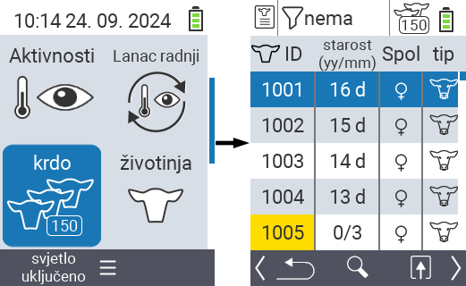
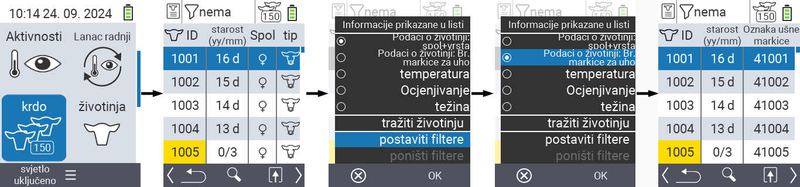
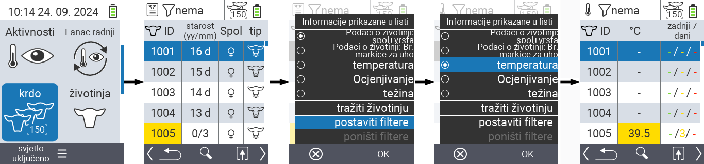
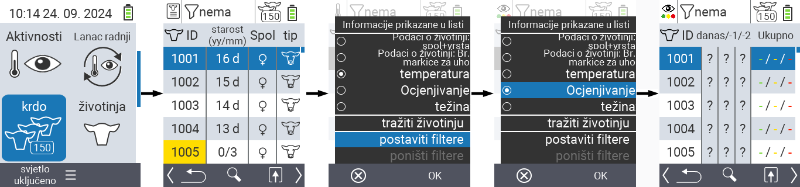
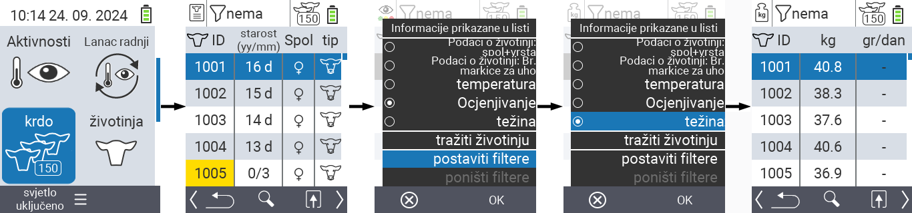
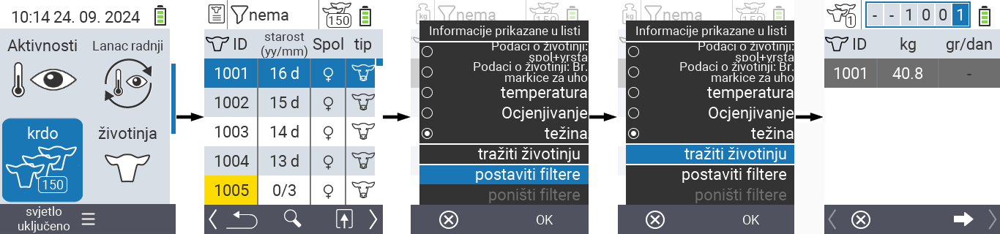
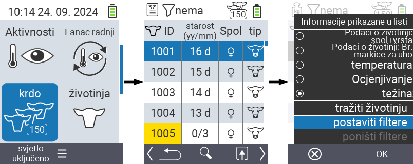
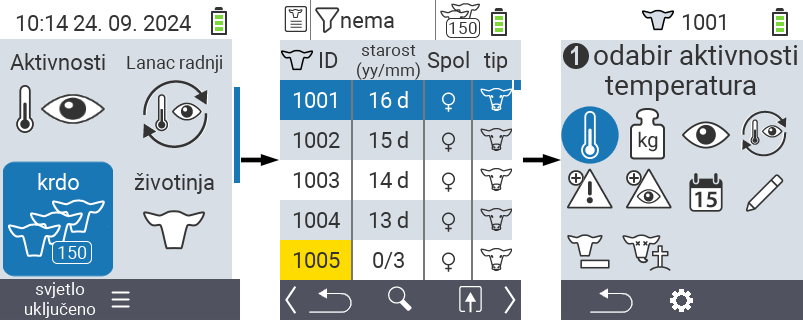

## Stado {#herd}

Unutar stavke menija Stado, možete pregledati cijelo svoje stado, pretraživati pojedinačne životinje i prikazivati važne informacije. Imate sljedeće mogućnosti:

- Pogledajte [podatke o životinjama](#view-animal-data)
- Pogledajte [podatke o temperaturi](#display-temperature)
- Pogledajte [podatke o ocjeni](#view-rating)
- Pogledajte [podatke o težini](#view-rating)
- [Pretražite životinju](#search-animal)
- Postavite [filter](#set-filter)
- [Akcije](#call-action-menu)

### Pripremni koraci {#preparatory-steps}

1. Na glavnom ekranu vašeg VitalControl uređaja, odaberite stavku menija  `` i pritisnite dugme ``.

2. Otvara se pregled vašeg stada.

    

### Pogledajte podatke o životinjama {#view-animal-data}

1. Završite pripremne korake.

2. Koristite tipku `F3` &nbsp;&nbsp; da pozovete popup meni koji navodi kategorije informacija koje se mogu prikazati za listu stada. Koristite tipke sa strelicama △ ▽ da označite liniju `` ili `` i odaberite ovu kategoriju pritiskom na centralno dugme `` ili tipku `F3` ``. Dvije opcije izbora se razlikuju u prikazu informacione trake.

3. Podaci o životinjama će sada biti prikazani kao sadržaj liste stada.

4. Alternativno, možete koristiti tipke sa strelicama ◁ ▷ da se prebacujete između različitih opcija prikaza.

    

{}
Podaci o životinjama su po defaultu prikazani prvi. Samo kada imate prikazanu težinu, na primjer, morate ponovo postaviti prikaz podataka o životinjama.
{}

### Prikaz temperature {#display-temperature}

1. Završite pripremne korake.

2. Koristite tipku `F3` &nbsp;&nbsp; da biste pozvali skočni meni koji prikazuje kategorije informacija koje se mogu prikazati za listu stada. Koristite tipke sa strelicama △ ▽ da označite liniju `` i odaberite ovu kategoriju pritiskom na centralno dugme `` ili tipku `F3` ``.

3. Podaci o temperaturi će sada biti prikazani kao sadržaj liste stada.

4. Alternativno, možete koristiti tipke sa strelicama ◁ ▷ da biste se prebacivali između različitih opcija prikaza.

    

### Prikaz ocjene {#view-rating}

1. Završite pripremne korake.

2. Koristite tipku `F3` &nbsp;&nbsp; da biste pozvali skočni meni koji prikazuje kategorije informacija koje se mogu prikazati za listu stada. Koristite tipke sa strelicama △ ▽ da označite liniju `` i odaberite ovu kategoriju pritiskom na centralno dugme `` ili tipku `F3` ``.

3. Podaci o ocjeni će sada biti prikazani kao sadržaj liste stada.

4. Alternativno, možete koristiti tipke sa strelicama ◁ ▷ da biste se prebacivali između različitih opcija prikaza.

    

### Prikaz težine {#display-weight}

1. Završite pripremne korake.

2. Koristite tipku `F3` &nbsp;&nbsp; da biste pozvali skočni meni koji prikazuje kategorije informacija koje se mogu prikazati za listu stada. Koristite tipke sa strelicama △ ▽ da označite liniju `` i odaberite ovu kategoriju pritiskom na centralno dugme `` ili tipku `F3` ``.

3. Podaci o težini će sada biti prikazani kao sadržaj liste stada.

4. Alternativno, možete koristiti tipke sa strelicama ◁ ▷ da biste se prebacivali između različitih opcija prikaza.

    

### Pretraži životinju {#search-animal}

1. Završite pripremne korake.

2. Koristite `F3` tipku &nbsp;&nbsp; da biste pozvali popup meni koji prikazuje razne opcije. Koristite strelice △ ▽ da označite funkciju `` i pokrenite funkciju pretrage pritiskom na centralnu `` tipku ili `F3` tipku ``. Alternativno, možete koristiti `On/Off` dugme  odmah nakon prvog koraka.

3. Koristite strelice △ ▽ ◁ ▷ da unesete željeni broj životinje i potvrdite sa ``.

    

### Postavi filter {#set-filter}

1. Završite pripremne korake.

2. Koristite `F3` tipku &nbsp;&nbsp; da biste pozvali popup meni koji prikazuje razne opcije. Koristite strelice △ ▽ da označite funkciju `` i pokrenite funkciju filtera pritiskom na centralnu `` tipku ili `F3` tipku ``.

3. Kako primijeniti filter možete pronaći [ovdje]().

    

### Pozovi akcioni meni {#call-action-menu}

Uvijek imate opciju da pozovete akcioni meni za životinju.

1. Završite pripremne korake.

2. Odaberite životinju sa liste koristeći strelice △ ▽ i potvrdite sa ``.

3. Akcioni meni je sada otvoren. Kako ga koristiti možete pronaći [ovdje](../actions).

4. Vratite se na listu stada sa `F3` tipkom.

    
