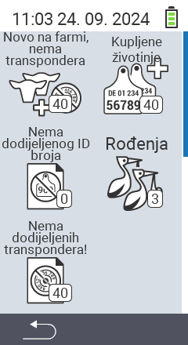

{}
Ako kliknete na stavku izbornika, bit ćete preusmjereni na opis odgovarajuće funkcije.
{}

<map name="workmap">
  <area shape="rect" coords="3,40,116,160" alt="Novo na farmi, bez transpondera" title="Ovdje dodjeljujete transponder novim životinjama bez transpondera&#10;Klik mišem: otvorite dokumentaciju" href="/bs/docs/new-on-farm/new-no-transponder/">
  <area shape="rect" coords="3,160,116,280" alt="Nije dodijeljen nacionalni ID životinje" title="Ovdje možete vidjeti sve životinje kojima još nije dodijeljen nacionalni ID životinje i dodijeliti im nacionalni ID životinje&#10;Klik mišem: otvorite dokumentaciju" href="/bs/docs/new-on-farm/no-national-animal-id-assigned/">
  <area shape="rect" coords="3,280,116,399" alt="Nije dodijeljen transponder" title="Ovdje možete vidjeti sve životinje kojima još nije dodijeljen transponder i dodijeliti im transponder&#10;Klik mišem: otvorite dokumentaciju" href="/bs/docs/new-on-farm/no-transponder-assigned/">

  <area shape="rect" coords="116,40,230,160" alt="Kupljene životinje" title="Ovdje možete vidjeti svoje trenutne kupovine i izvesti podatke&#10;Klik mišem: otvorite dokumentaciju" href="/bs/docs/new-on-farm/purchased-animals/">
  <area shape="rect" coords="116,160,230,280" alt="Rođenja" title="Ovdje možete vidjeti svoja rođenja i kreirati izvoznu datoteku&#10;Klik mišem: otvorite dokumentaciju" href="/bs/docs/new-on-farm/births/">
  <area shape="rect" coords="1,401,100,439" alt="Nazad" title="Vratite se jedan nivo unazad&#10;Klik mišem: na dokumentaciju" href="/bs/docs/menu/mainmenu/">
</map>
