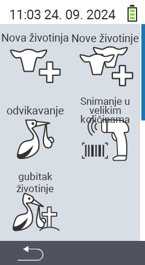

Putem glavne stavke menija  `` dolazite do podmenija, gdje je za odabir predstavljeno 5 podstavki:

<map name="workmap">
  <area shape="rect" coords="3,40,116,160" alt="Nova životinja" title="Kako registrovati novu životinju koristeći VitalControl uređaj&#10;Klik mišem: otvori dokumentaciju" href="/bs/docs/new/animal/">
  <area shape="rect" coords="3,160,116,280" alt="Teljenje" title="Kako registrovati novo teljenje koristeći VitalControl uređaj&#10;Klik mišem: otvori dokumentaciju" href="/bs/docs/new/calving/">
  <area shape="rect" coords="3,280,116,399" alt="Gubitak životinje" title="Kako registrovati gubitak životinje koristeći VitalControl uređaj&#10;Klik mišem: otvori dokumentaciju" href="/bs/docs/new/animal-loss/">

  <area shape="rect" coords="116,40,230,160" alt="Nove životinje" title="Kako kreirati više novih životinja na VitalControl uređaju koristeći jednu akciju&#10;Klik mišem: otvori dokumentaciju" href="/bs/docs/new/animals/">
  <area shape="rect" coords="116,160,230,280" alt="Masovno snimanje" title="Koristite skener bar koda za snimanje različitih životinja&#10;Klik mišem: otvori dokumentaciju" href="/bs/docs/new/bulk-recording/">

  <area shape="rect" coords="1,401,100,439" alt="Nazad" title="Vratite se jedan nivo unazad&#10;Klik mišem: na dokumentaciju" href="/bs/docs/menu/mainmenu/">
</map>

{}
Svaki podmeni nosi svoju ikonu. Pomjerite pokazivač miša preko ikone na gornjoj grafici i zadržite ga na trenutak. Pojavit će se tooltip, prikazujući informacije za odabrani podmeni. Ako kliknete na jednu od ikona, bit ćete preusmjereni na opis odabrane stavke podmenija.
{}

