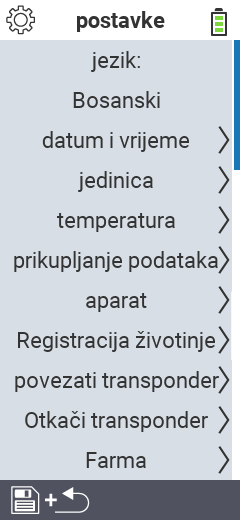

{}
Ako kliknete na stavku izbornika, bit ćete preusmjereni na opis odgovarajuće funkcije.
{}

<map name="workmap">
  <area shape="rect" coords="2,40,230,120" alt="Jezik" title="Postavite i trajno pohranite jezik korisničkog sučelja na vašem VitalControl uređaju&#10;Klik mišem: otvorite dokumentaciju" href="/bs/docs/settings/language/">
  <area shape="rect" coords="2,120,230,160" alt="Datum i Vrijeme" title="Ovdje postavljate datum i vrijeme&#10;Klik mišem: otvorite dokumentaciju" href="/bs/docs/settings/datetime/">
  <area shape="rect" coords="2,160,230,200" alt="Jedinice" title="Ovdje birate jedinice za temperaturu i masu&#10;Klik mišem: otvorite dokumentaciju" href="/bs/docs/settings/units/">
  <area shape="rect" coords="2,200,230,240" alt="Temperatura" title="Postavite postavke temperature za primjenu vašeg VitalControl uređaja&#10;Klik mišem: otvorite dokumentaciju" href="/bs/docs/settings/temperature/">
   <area shape="rect" coords="2,240,230,280" alt="Prikupljanje podataka" title="Ovdje pohranjujete relevantne informacije za prikupljanje podataka o životinjama&#10;Klik mišem: otvorite dokumentaciju" href="/bs/docs/settings/data-acquisition/">
   <area shape="rect" coords="2,280,230,320" alt="Uređaj" title="Ovdje možete prilagoditi razne postavke uređaja&#10;Mausklick: zur Dokumentation" href="/bs/docs/settings/device/">
   <area shape="rect" coords="2,320,230,360" alt="Registracija životinja" title="Ovdje možete prilagoditi nekoliko tvornički postavljenih standarda u vezi s registracijom novih životinja prema zahtjevima vaše farme.&#10;Klik mišem: otvorite dokumentaciju" href="/bs/docs/settings/animal-registration/">
   <area shape="rect" coords="2,360,230,400" alt="Povezivanje transpondera" title="Postavite dodjelu transpondera na vašem VitalControl uređaju&#10;Klik mišem: otvorite dokumentaciju" href="/bs/docs/settings/transponder-linkage/">
   <area shape="rect" coords="2,400,230,439" alt="Odspajanje transpondera" title="Odredite kako će se dodijeliti ID životinje nakon odspajanja transpondera&#10;Klik mišem: otvorite dokumentaciju" href="/bs/docs/settings/transponder-linkage/">
   <area shape="rect" coords="2,440,230,480" alt="Farma" title="Trajno pohranite svoj službeni dvanaestoznamenkasti nacionalni ID farme na VitalControl uređaju&#10;Klik mišem: otvorite dokumentaciju" href="/bs/docs/settings/farm-number/">
   <area shape="rect" coords="2,482,123,519" alt="Nazad" title="Vratite se jedan nivo unazad" href="/bs/docs/menu/mainmenu/">
</map>

