
<a class="btn btn-lg btn-primary me-3 mb-4" href="#td-block-2">
  Více informací <i class="fas fa-arrow-alt-circle-right ms-2"></i>
</a>
<a class="btn btn-lg btn-secondary me-3 mb-4" href="docs/">
  Dokumentace<i class="fa-solid fa-book ms-2 "></i>
</a>

Správa zdraví na nejvyšší úrovni!




{}

**Snižte** **papírování**  

**Zvyšte** **zdraví zvířat**

Mějte **vše** na **dohled**   

S **jedním zařízením**     
{}


{}
 

    

    <button type="button" data-bs-target="#carouselLanguageIndicators" data-bs-slide-to="0" class="active" aria-current="true" aria-label="German"></button>
    <button type="button" data-bs-target="#carouselLanguageIndicators" data-bs-slide-to="1" aria-label="English"></button>
    <button type="button" data-bs-target="#carouselLanguageIndicators" data-bs-slide-to="2" aria-label="Dutch"></button>
    <button type="button" data-bs-target="#carouselLanguageIndicators" data-bs-slide-to="3" aria-label="Finish"></button>
    <button type="button" data-bs-target="#carouselLanguageIndicators" data-bs-slide-to="4" aria-label="French"></button>
    <button type="button" data-bs-target="#carouselLanguageIndicators" data-bs-slide-to="5" aria-label="Russian"></button>
    <button type="button" data-bs-target="#carouselLanguageIndicators" data-bs-slide-to="6" aria-label="Spanish"></button>
    <button type="button" data-bs-target="#carouselLanguageIndicators" data-bs-slide-to="7" aria-label="Bosnian"></button>
    <button type="button" data-bs-target="#carouselLanguageIndicators" data-bs-slide-to="8" aria-label="Bulgarian"></button>
    <button type="button" data-bs-target="#carouselLanguageIndicators" data-bs-slide-to="9" aria-label="Chinese"></button>
    <button type="button" data-bs-target="#carouselLanguageIndicators" data-bs-slide-to="10" aria-label="Czech"></button>
    <button type="button" data-bs-target="#carouselLanguageIndicators" data-bs-slide-to="11" aria-label="Norwegian"></button>
    <button type="button" data-bs-target="#carouselLanguageIndicators" data-bs-slide-to="12" aria-label="Greek"></button>
    <button type="button" data-bs-target="#carouselLanguageIndicators" data-bs-slide-to="13" aria-label="Turkish"></button>
    <button type="button" data-bs-target="#carouselLanguageIndicators" data-bs-slide-to="14" aria-label="Ukrainian"></button>
    <button type="button" data-bs-target="#carouselLanguageIndicators" data-bs-slide-to="15" aria-label="Estonian"></button>
    
 

    

      

        <h3>German</h3>
      

      
    

    

      

        <h3>Dutch</h3>
      

      
    

    

      

        <h3>English</h3>
      

      
    

    

      

        <h3>Finnish</h3>
      

      
    

    

      

        <h3>French</h3>
      

      
    

    

      

        <h3>Russian</h3>
      

    
    
  
    

      

        <h3>Spanish</h3>
      

    
    

      

        

          <h3>Bosnian</h3>
        

      
      

      

        

          <h3>Bulgarian</h3>
        

      
      

      

        

          <h3>Chinese</h3>
        

      
      

      

        

          <h3>Czech</h3>
        

      
      

      

        

          <h3>Norwegian</h3>
        

      
      

      

        

          <h3>Greek</h3>
        

      
      
      
      

        

          <h3>Turkish</h3>
        

      
      
 
      

        

          <h3>Ukrainian</h3>
        

      
      
 
      

        

          <h3>Estonian</h3>
        

      
      
 
  

  <button class="carousel-control-prev" type="button" data-bs-target="#carouselLanguagesAutoplaying" data-bs-slide="prev" style="left: 0px; top: 37px; height: 320px;">
    
    Previous
  </button>
  <button class="carousel-control-next" type="button" data-bs-target="#carouselLanguagesAutoplaying" data-bs-slide="next" style="right: 0px; top: 37px; height: 320px;">
    
    Next
  </button>

{}

{}
 

    

    <button type="button" data-bs-target="#carouselActionsIndicators" data-bs-slide-to="0" class="active" aria-current="true" aria-label="Teplota"></button>
    <button type="button" data-bs-target="#carouselActionsIndicators" data-bs-slide-to="1" aria-label="Vážení"></button>
    <button type="button" data-bs-target="#carouselActionsIndicators" data-bs-slide-to="2" aria-label="Hodnocení"></button>
    <button type="button" data-bs-target="#carouselActionsIndicators" data-bs-slide-to="3" aria-label="Řetězec akcí"></button>
    <button type="button" data-bs-target="#carouselActionsIndicators" data-bs-slide-to="4" aria-label="Alarm"></button>
    <button type="button" data-bs-target="#carouselActionsIndicators" data-bs-slide-to="5" aria-label="Na hlídce"></button>
    <button type="button" data-bs-target="#carouselActionsIndicators" data-bs-slide-to="6" aria-label="Historie zvířete"></button>
    <button type="button" data-bs-target="#carouselActionsIndicators" data-bs-slide-to="7" aria-label="Upravit"></button>
    <button type="button" data-bs-target="#carouselActionsIndicators" data-bs-slide-to="8" aria-label="Odregistrovat"></button>
    <button type="button" data-bs-target="#carouselActionsIndicators" data-bs-slide-to="9" aria-label="Ztráta zvířete"></button>
    <button type="button" data-bs-target="#carouselActionsIndicators" data-bs-slide-to="10" aria-label="Připojit transpondér"></button>
    <button type="button" data-bs-target="#carouselActionsIndicators" data-bs-slide-to="11" aria-label="Odpojit transpondér"></button>
    <button type="button" data-bs-target="#carouselActionsIndicators" data-bs-slide-to="12" aria-label="Připojit ID zvířete"></button>
    <button type="button" data-bs-target="#carouselActionsIndicators" data-bs-slide-to="13" aria-label="Připojit elektronické ID zvířete"></button>
  

    

      

        <h3>Teplota</h3>
      

      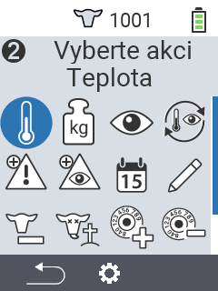
    

    

      

        <h3>Vážení</h3>
      

      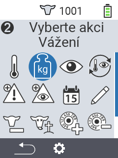
    

    

      

        <h3>Hodnocení</h3>
      

      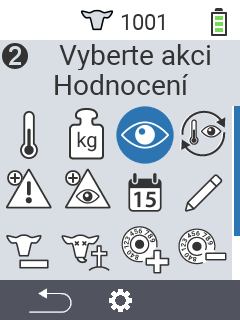
    

    

      

        <h3>Řetězec akcí</h3>
      

      
    

    

      

        <h3>Alarm</h3>
      

      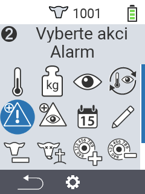
    

    

      

        <h3>Na hlídce</h3>
      

      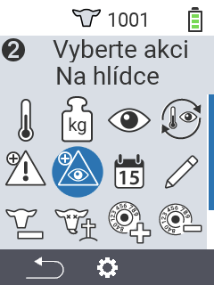
    

    

      

        <h3>Historie zvířete</h3>
      

      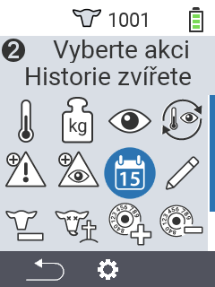
    

    

      

        <h3>Upravit</h3>
      

      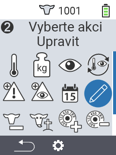
    

    

      

        <h3>Odregistrovat</h3>
      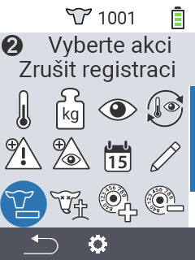
      

    

    

      

        <h3>Ztráta zvířete</h3>
      

      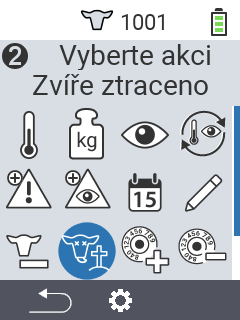
    

    

      

        <h3>Připojit transpondér</h3>
      

      
    

    

      

        <h3>Odpojit transpondér</h3>
      

      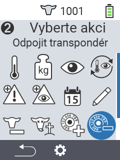
    
      
    

      

        <h3>Připojit ID zvířete</h3>
      

      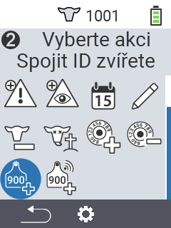
    
   
    

      

        <h3>Připojit ID zvířete</h3>
      

      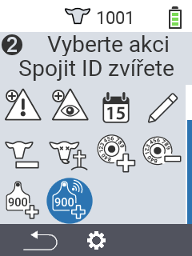
    
             
  

  <button class="carousel-control-prev" type="button" data-bs-target="#carouselActionsAutoplaying" data-bs-slide="prev" style="left: 0px; top: 37px; height: 320px;">
    
    Předchozí
  </button>
  <button class="carousel-control-next" type="button" data-bs-target="#carouselActionsAutoplaying" data-bs-slide="next" style="right: 0px; top: 37px; height: 320px;">
    
    Další
  </button>

{}

{}
 

    

    <button type="button" data-bs-target="#carouselListsIndicators" data-bs-slide-to="0" class="active" aria-current="true" aria-label="Alarm"></button>
    <button type="button" data-bs-target="#carouselListsIndicators" data-bs-slide-to="1" aria-label="Na hlídce"></button>
    <button type="button" data-bs-target="#carouselListsIndicators" data-bs-slide-to="2" aria-label="Akce"></button>
    <button type="button" data-bs-target="#carouselListsIndicators" data-bs-slide-to="3" aria-label="Čerstvé krávy"></button>
    <button type="button" data-bs-target="#carouselListsIndicators" data-bs-slide-to="4" aria-label="Suché krávy"></button>
  

    

      

        <h3>Alarm</h3>
      

      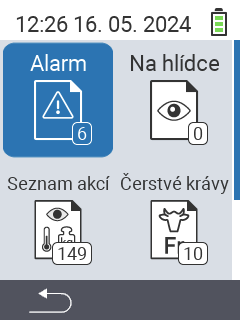
    

    

      

        <h3>Na hlídce</h3>
      

      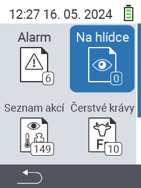
    

    

      

        <h3>Seznam akcí</h3>
      
      
      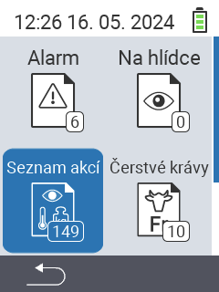
    

    

      

        <h3>Čerstvé krávy</h3>
      

      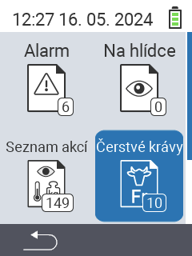
    

    

      

        <h3>Suché krávy</h3>
      

    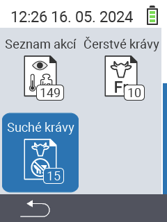
    

  

  <button class="carousel-control-prev" type="button" data-bs-target="#carouselListsAutoplaying" data-bs-slide="prev" style="left: 0px; top: 37px; height: 320px;">
    
    Předchozí
  </button>
  <button class="carousel-control-next" type="button" data-bs-target="#carouselListsAutoplaying" data-bs-slide="next" style="right: 0px; top: 37px; height: 320px;">
    
    Další
  </button>

{}

{}
 

    

    <button type="button" data-bs-target="#carouselListsIndicators" data-bs-slide-to="0" class="active" aria-current="true" aria-label="Hodnocení váhy"></button>
    <button type="button" data-bs-target="#carouselListsIndicators" data-bs-slide-to="1" aria-label="Hodnocení teploty"></button>
    <button type="button" data-bs-target="#carouselListsIndicators" data-bs-slide-to="2" aria-label="Hodnocení hodnocení"></button>
    <button type="button" data-bs-target="#carouselListsIndicators" data-bs-slide-to="3" aria-label="Hodnocení úmrtnosti"></button>
  

    

      

        <h3>Váha</h3>
      
 
      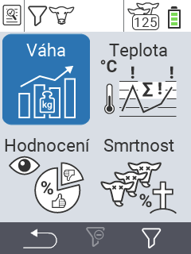
    

    

      

        <h3>Teplota</h3>
      
 
      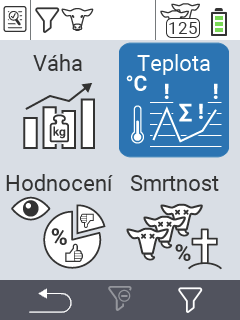
    

    

      

        <h3>Hodnocení</h3>
      
 
      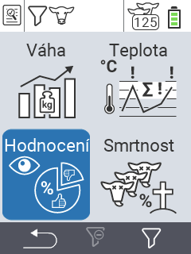
    

    

      

        <h3>Úmrtnost</h3>
      
 
      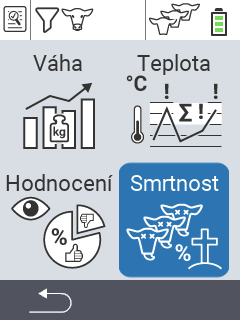
    

  

  <button class="carousel-control-prev" type="button" data-bs-target="#carouselEvaluationAutoplaying" data-bs-slide="prev" style="left: 0px; top: 37px; height: 320px;">
    
    Předchozí
  </button>
  <button class="carousel-control-next" type="button" data-bs-target="#carouselEvaluationAutoplaying" data-bs-slide="next" style="right: 0px; top: 37px; height: 320px;">
    
    Další
  </button>

{}


{}

Vhodné pro několik **typů zvířat** v různých **věkových kategoriích**

{}


{}
 

 
{}

{}
 

 
{}

{}
 

 
{}



{}

Naše **highlights** pro vás

{}


{}
 

 
{}

{}
 
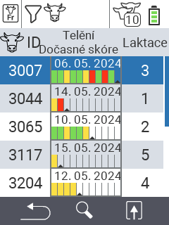
 
{}

{}
 

 
{}

{}
 
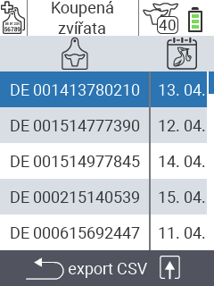
 
{}



{}
Urban na sociálních sítích

{}

{}

{}
{}

{}
{}

{}
{}

{}
{}


