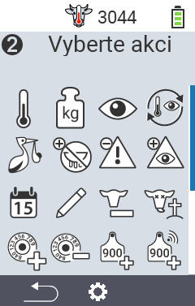
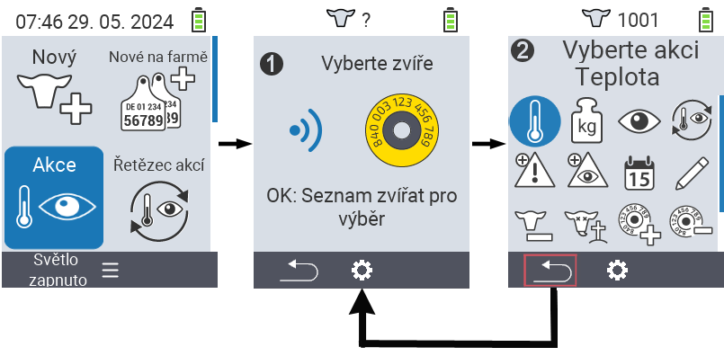
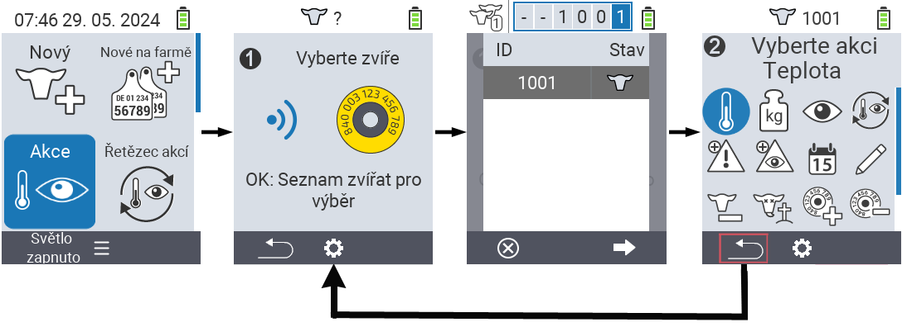

## Dostupné akce

V závislosti na typu zvířete můžete provádět až 16 různých akcí na zvířeti.

<map name="workmap">
  <area shape="rect" coords="3,100,60,165" alt="Teplota" title="Měření horečky u vašich zvířat&#10;Kliknutí myší: otevřít dokumentaci" href="/cs/docs/actions/measure-temperature/">
  <area shape="rect" coords="60,100,118,165" alt="Vážení" title="Zaznamenání hmotnosti vašich zvířat&#10;Kliknutí myší: otevřít dokumentaci" href="/cs/docs/actions/record-weight/">
  <area shape="rect" coords="118,100,174,165" alt="Hodnocení" title="Hodnocení vašich zvířat&#10;Kliknutí myší: otevřít dokumentaci" href="/cs/docs/actions/rating/">
  <area shape="rect" coords="174,100,230,165" alt="Řetězec akcí" title="Aplikace a nastavení řetězce akcí&#10;Kliknutí myší: otevřít dokumentaci" href="/cs/docs/chain-of-actions/">
   <area shape="rect" coords="3,165,60,225" alt="Otelení" title="Registrace otelení&#10;Kliknutí myší: otevřít dokumentaci" href="/cs/docs/actions/calving/">
   <area shape="rect" coords="60,165,120,225" alt="Zasušení" title="Zasušení krávy nebo přidání na seznam čerstvých krav&#10;Kliknutí myší: otevřít dokumentaci" href="/cs/docs/actions/dry-off/">
   <area shape="rect" coords="120,165,175,225" alt="Alarm" title="Přidání a odstranění zvířat ze seznamu alarmů&#10;Kliknutí myší: otevřít dokumentaci" href="/cs/docs/actions/alarm/">
   <area shape="rect" coords="175,165,230,225" alt="Na pozorování" title="Přidání zvířat na seznam pozorování nebo jejich odstranění&#10;Kliknutí myší: otevřít dokumentaci" href="/cs/docs/actions/on-watch/">
   <area shape="rect" coords="3,225,60,280" alt="Historie zvířete" title="Zobrazení historie zvířete&#10;Kliknutí myší: otevřít dokumentaci" href="/cs/docs/actions/animal-history/">
   <area shape="rect" coords="60,225,120,280" alt="Úprava" title="Úprava údajů vybraného zvířete&#10;Kliknutí myší: otevřít dokumentaci" href="/cs/docs/actions/edit/">
   <area shape="rect" coords="120,225,175,280" alt="Odhlášení" title="Odhlášení zvířete&#10;Kliknutí myší: otevřít dokumentaci" href="/cs/docs/actions/unregister/">
   <area shape="rect" coords="175,225,230,280" alt="Ztráta zvířete" title="Registrace ztráty zvířete&#10;Kliknutí myší: otevřít dokumentaci" href="/cs/docs/actions/animal-loss/">
   <area shape="rect" coords="3,280,60,337" alt="Přiřazení transpondéru" title="Přiřazení transpondéru ke zvířeti&#10;Kliknutí myší: otevřít dokumentaci" href="/cs/docs/actions/link-transponder/">
   <area shape="rect" coords="55,280,120,337" alt="Odstranění transpondéru" title="Odstranění přiřazení transpondéru ke zvířeti&#10;Kliknutí myší: otevřít dokumentaci" href="/cs/docs/actions/unlink-transponder/">
   <area shape="rect" coords="120,280,175,337" alt="Ruční přiřazení ID zvířete" title="Přiřazení národního ID zvířete ke zvířeti, které nemá národní ID&#10;Kliknutí myší: otevřít dokumentaci" href="/cs/docs/actions/link-animal-id/#link-animal-id">
   <area shape="rect" coords="175,280,230,337" alt="Přiřazení ID zvířete skenováním" title="Přiřazení národního ID zvířete ke zvířeti, které nemá národní ID&#10;Kliknutí myší: otevřít dokumentaci" href="/cs/docs/actions/link-animal-id/#link-animal-id-with-electronic-ear-tag-scan">

   <area shape="rect" coords="100,340,140,375" alt="Nastavení" title="Vyvolání nastavení&#10;Kliknutí myší: na dokumentaci" href="/cs/docs/actions/settings/">
</map>

{}
Každá akce je identifikována symbolem. Přesuňte ukazatel myši nad symbol v níže uvedené grafice a nechte jej chvíli odpočívat. Zobrazí se tooltip, který představí informace o příslušné akci. Pokud kliknete na jeden ze symbolů, budete přesměrováni na popis příslušné akce.
{}

## Obecný postup

V rámci menu   `Akce` můžete kdykoli vybrat další zvíře, aniž byste museli opustit položku menu Akce. Pro výběr dalšího zvířete postupujte následovně:

1. Vyberte položku menu   `Akce` na hlavní obrazovce vašeho zařízení VitalControl a stiskněte tlačítko `OK`.

2. Buď naskenujte zvíře pomocí transpondéru, nebo vyberte zvíře ze seznamu. Potvrďte stisknutím tlačítka `OK` a vyberte zvíře pomocí šipek △ ▽. Potvrďte tlačítkem `OK`.

3. Otevře se podmenu, ve kterém najdete ikony pro různé akce se zvířaty. Pomocí šipek vyberte požadovanou akci a spusťte ji stisknutím tlačítka `OK`. V závislosti na vybrané akci se zobrazí jedna nebo více obrazovek nebo vyskakovací okno.

4. Pokud si přejete, můžete nyní vybrat a provést další akci pro aktuální zvíře.

5. Po provedení požadované akce (akcí) pro zvíře se vraťte ke kroku 2 'Výběr zvířete'. K tomu stiskněte levé tlačítko `F1` pod symbolem `Zpět` v levém dolním rohu zápatí.

6. Okno z kroku dva se automaticky znovu otevře a můžete vybrat další zvíře nebo se vrátit do hlavního menu stisknutím tlačítka `F1` pod symbolem `Zpět`.



{}

{}
{}

{}


