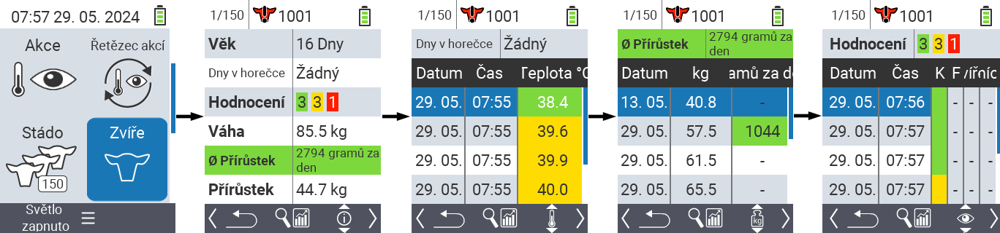
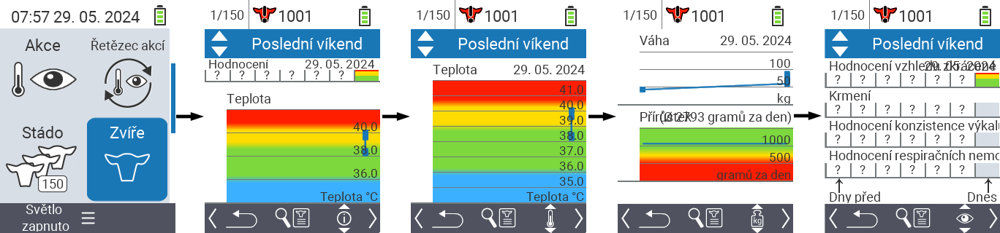
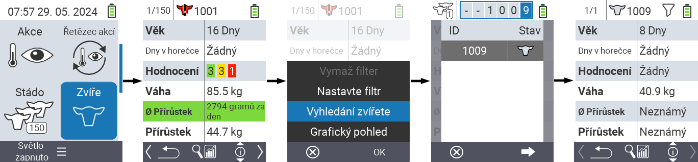
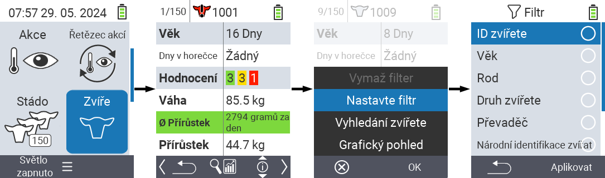

## Zvíře

Funkce jednotlivého zvířete vám umožňuje zobrazit důležité informace o hmotnosti, teplotě a hodnocení každého jednotlivého zvířete. Vždy máte možnost zobrazit informace jako grafiku nebo jako seznam. Chcete-li použít funkci jednotlivého zvířete, postupujte následovně:

1. Na hlavní obrazovce vašeho zařízení VitalControl vyberte položku menu  `Zvíře` a stiskněte tlačítko `OK`.

2. Otevře se přehled nejdůležitějších informací o zvířeti. Horní okraj obrazovky vám ukazuje, které zvíře právě prohlížíte. Pomocí klávesy `F3` můžete vybírat mezi informacemi o zvířeti , teplotou , hmotností  a hodnocením .

{}
V rámci každého zobrazení informací máte možnost [vyhledat zvíře](#search-animal), nastavit [filtr](#set-filter) a přepnout na [grafické zobrazení](#set-graphical-view).
Také můžete kdykoli přepínat mezi jednotlivými zvířaty pomocí šipek ◁ ▷.
{}

### Nastavit grafické zobrazení

1. Stiskněte prostřední horní tlačítko `Zap/Vyp`  pro otevření pop up menu. V tomto menu můžete vybírat mezi funkcemi `Nastavit filtr`, `Vyhledat zvíře` nebo `Grafické zobrazení`.

2. Vyberte `Grafické zobrazení` pomocí šipek △ ▽ a potvrďte tlačítkem `OK`.

### Hledat zvíře

1. Stiskněte prostřední horní tlačítko `Zap/Vyp`  pro otevření pop up menu. V tomto menu můžete vybrat mezi funkcemi `Nastavit filtr`, `Hledat zvíře` nebo `Grafický pohled`.

2. Vyberte `Hledat zvíře` pomocí šipek △ ▽ a potvrďte `OK`.

3. Použijte šipky △ ▽ ◁ ▷ k výběru požadovaného čísla zvířete a potvrďte `OK`.

### Nastavit filtr

1. Stiskněte prostřední horní tlačítko `Zap/Vyp`  pro otevření pop up menu. V tomto menu můžete vybrat mezi funkcemi `Nastavit filtr`, `Hledat zvíře` nebo `Grafický pohled`.

2. Vyberte `Nastavit filtr` pomocí šipek △ ▽ a potvrďte `OK`.
Návod na použití filtru najdete [zde]().

