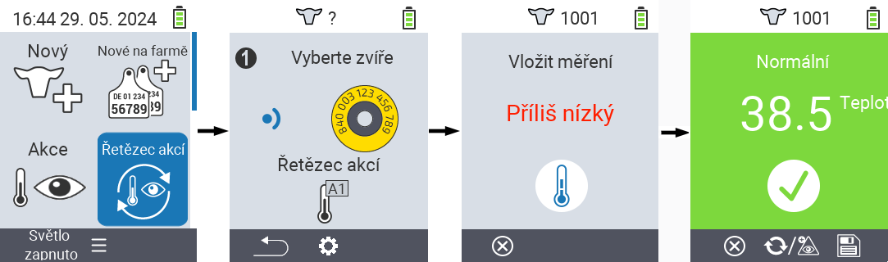
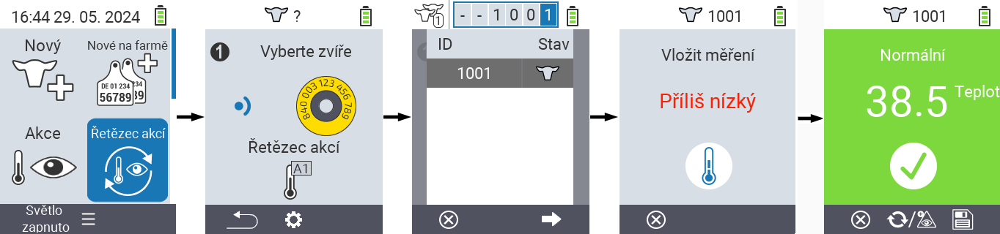
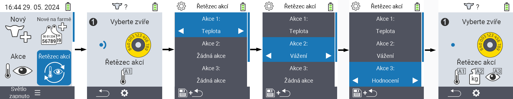

## Řetězec akcí {#chain-of-actions}

Řetězec akcí vám umožňuje automaticky provádět několik akcí pro zvíře jednu po druhé. Například můžete vybrat akce `` a ``. Pokud poté provedete řetězec akcí, můžete nejprve změřit teplotu svého zvířete a ihned poté zaznamenat hodnocení.

### Použití řetězce akcí {#use-chain-of-actions}

1. Na hlavní obrazovce vašeho zařízení VitalControl vyberte položku menu &nbsp;&nbsp; `` a stiskněte tlačítko ``.

2. Buď naskenujte zvíře pomocí transpondéru, nebo potvrďte tlačítkem `` a pomocí šipek △ ▽ ◁ ▷ zadejte požadované ID zvířete.

3. Nyní je řetězec akcí proveden. Jakmile jsou všechny akce v řetězci akcí provedeny, lze přímo vybrat další zvíře.



{}

{}
{}

{}


### Nastavení řetězce akcí {#set-chain-of-actions}

1. Na hlavní obrazovce vašeho zařízení VitalControl vyberte položku menu &nbsp;&nbsp; `` a stiskněte tlačítko ``.

2. Použijte tlačítko `F2` &nbsp;&nbsp; (``).

3. Objeví se překryvná obrazovka. Pomocí šipek △ ▽ vyberte mezi uvedenými akcemi 1 - 4 (můžete provést až čtyři akce za sebou). Pomocí šipek ◁ ▷ vyberte požadovanou akci pro příslušnou akci. Nastavení uložte tlačítkem `F1` &nbsp;&nbsp;.

4. Pokud chcete resetovat celý řetězec akcí, vyberte možnost `` v podmenu pomocí šipek △ ▽ a potvrďte ``.

    

{}
V rámci jednotlivých akcí máte stejné možnosti nastavení, jak je popsáno v kapitole [Akce](../actions) pro každou jednotlivou akci.
{}

{}
Symboly na úvodní obrazovce řetězce akcí ukazují, které akce jste nastavili a v jakém pořadí.
{}
