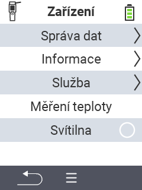

{}
Pokud kliknete na položku menu, budete přesměrováni na popis příslušné funkce.
{}

<map name="workmap">
  <area shape="rect" coords="2,40,238,80" alt="Správa dat" title="Spusťte zálohování dat, exportujte svá data a resetujte zařízení&#10;Kliknutí myší: otevřít dokumentaci" href="/cs/docs/device/data-management/">
  <area shape="rect" coords="2,80,238,120" alt="Info" title="Zobrazte důležité informace o softwaru a hardwaru&#10;Kliknutí myší: otevřít dokumentaci" href="/cs/docs/device/info/">
  <area shape="rect" coords="2,120,238,160" alt="Servis" title="Zkontrolujte ovladače zařízení, aktualizujte firmware a proveďte test dosahu&#10;Kliknutí myší: otevřít dokumentaci" href="/cs/docs/device/service/">
  <area shape="rect" coords="2,160,238,200" alt="Měření teploty" title="Otestujte měření teploty vašeho zařízení&#10;Kliknutí myší: otevřít dokumentaci" href="/cs/docs/device/temperature-measurement/">
  <area shape="rect" coords="2,200,238,240" alt="Svítilna" title="Zapněte nebo vypněte světlo na vašem zařízení VitalControl&#10;Kliknutí myší: otevřít dokumentaci" href="/cs/docs/device/flashlight/">

  <area shape="rect" coords="2,282,97,318" alt="Zpět" title="Přeskočit o úroveň zpět" href="/cs/docs/menu/mainmenu/">
</map>
