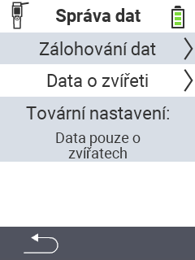

{}
Pokud kliknete na položku menu, budete přesměrováni na popis příslušné funkce.
{}

<map name="workmap">
  <area shape="rect" coords="2,40,238,80" alt="Zálohování dat" title="Pokyny pro vytvoření zálohy naleznete zde&#10;Kliknutí myší: otevřít dokumentaci" href="/cs/docs/device/data-management/data-backup/">

  <area shape="rect" coords="2,80,238,120" alt="Data zvířat" title="Pokyny pro obnovení zálohy naleznete zde&#10;Kliknutí myší: otevřít dokumentaci" href="/cs/docs/device/data-management/animal-data/">

  <area shape="rect" coords="2,120,238,200" alt="Obnovení továrního nastavení" title="Veškeré informace a pokyny pro resetování zařízení a dat zvířat naleznete zde&#10;Kliknutí myší: otevřít dokumentaci" href="/cs/docs/reset/">

  <area shape="rect" coords="2,282,120,319" alt="Zpět" title="Veškeré informace a pokyny pro export dat zvířat naleznete zde&#10;Kliknutí myší: otevřít dokumentaci" href="/cs/docs/device/">
</map>
