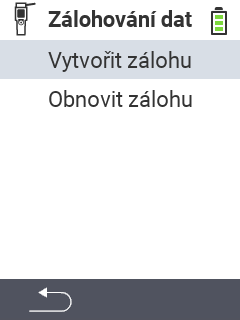

<map name="workmap">
  <area shape="rect" coords="2,40,238,80" alt="Vytvořit zálohu" title="Pokyny pro vytvoření zálohy naleznete zde&#10;Kliknutí myší: otevřít dokumentaci" href="/cs/docs/backup/backup/">

  <area shape="rect" coords="2,80,238,120" alt="Obnovit zálohu" title="Pokyny pro obnovení zálohy naleznete zde&#10;Kliknutí myší: otevřít dokumentaci" href="/cs/docs/backup/restore/">

  <area shape="rect" coords="2,282,120,319" alt="Zpět" title="Přeskočit o úroveň zpět&#10;Kliknutí myší: otevřít dokumentaci" href="/cs/docs/device/data-management/">
</map>
