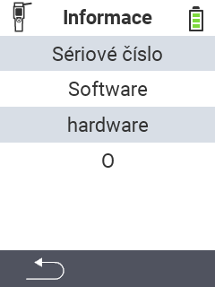

{}
Pokud kliknete na položku menu, budete přesměrováni na popis příslušné funkce.
{}

<map name="workmap">
  <area shape="rect" coords="2,40,238,80" alt="Sériové číslo" title="Pro získání sériového čísla vašeho zařízení klikněte zde&#10;Mausklick: zur Dokumentation" href="/cs/docs/device/info/serial-number/">
  <area shape="rect" coords="2,80,238,120" alt="Software" title="Pokyny pro zobrazení verze vašeho softwaru naleznete zde&#10;Mausklick: zur Dokumentation" href="/cs/docs/firmware/versions/">
  <area shape="rect" coords="2,120,238,160" alt="Hardware" title="Pro přístup k informacím o hardwaru vašeho zařízení klikněte zde&#10;Mausklick: zur Dokumentation" href="/cs/docs/device/info/hardware/">
  <area shape="rect" coords="2,160,238,200" alt="O aplikaci" title="Vyvolejte informace o dodavateli&#10;Mausklick: zur Dokumentation" href="/cs/docs/device/info/about/">

  <area shape="rect" coords="2,282,120,319" alt="Zpět" title="Přeskočit zpět na úroveň&#10;Mouse click: open documentation" href="/cs/docs/device/">
</map>
