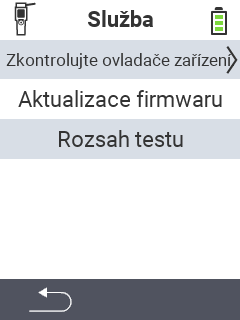

{}
Pokud kliknete na položku menu, budete přesměrováni na popis příslušné funkce.
{}

<map name="workmap">
  <area shape="rect" coords="2,42,238,82" alt="Zkontrolujte ovladače zařízení" title="Pokyny pro kontrolu ovladačů zařízení najdete zde&#10;Kliknutí myší: otevřít dokumentaci" href="/cs/docs/diagnosis/hardware/">
  <area shape="rect" coords="2,82,238,122" alt="Aktualizace firmwaru" title="Pokyny pro aktualizaci firmwaru najdete zde&#10;Kliknutí myší: otevřít dokumentaci" href="/cs/docs/firmware/update/">
  <area shape="rect" coords="2,122,238,162" alt="Test dosahu" title="Pokyny pro provedení testu dosahu najdete zde&#10;Kliknutí myší: otevřít dokumentaci" href="/cs/docs/diagnosis/rfid-scan/">

  <area shape="rect" coords="2,282,120,319" alt="Zpět" title="Návrat na úroveň&#10;Kliknutí myší: otevřít dokumentaci" href="/cs/docs/device/">
</map>
