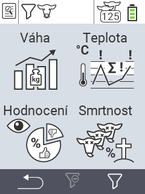

{}
Pokud kliknete na položku menu, budete přesměrováni na popis příslušné funkce.
{}

<map name="workmap">
  <area shape="rect" coords="3,40,116,160" alt="Hmotnost" title="Vyhodnoťte svá uložená data v sekci Hmotnost&#10;Kliknutí myší: otevřít dokumentaci" href="/cs/docs/evaluation/weight/">
  <area shape="rect" coords="3,160,116,279" alt="Hodnocení" title="Vyhodnoťte svá uložená data v sekci Hodnocení&#10;Kliknutí myší: otevřít dokumentaci" href="/cs/docs/evaluation/rating/">

  <area shape="rect" coords="116,40,238,160" alt="Teplota" title="Vyhodnoťte svá uložená data v sekci Teplota&#10;Kliknutí myší: otevřít dokumentaci" href="/cs/docs/evaluation/temperature/">
  <area shape="rect" coords="116,160,238,279" alt="Úmrtnost" title="Vyhodnoťte svá uložená data v sekci Úmrtnost&#10;Kliknutí myší: otevřít dokumentaci" href="/cs/docs/evaluation/mortality/">

  <area shape="rect" coords="150,282,238,319" alt="Filtr" title="Nastavit filtr&#10;Kliknutí myší: na dokumentaci" href="/cs/docs/filter">
  <area shape="rect" coords="2,282,95,319" alt="Zpět" title="Přeskočit o úroveň zpět&#10;Kliknutí myší: na dokumentaci" href="/cs/docs/menu/mainmenu/">
</map>
