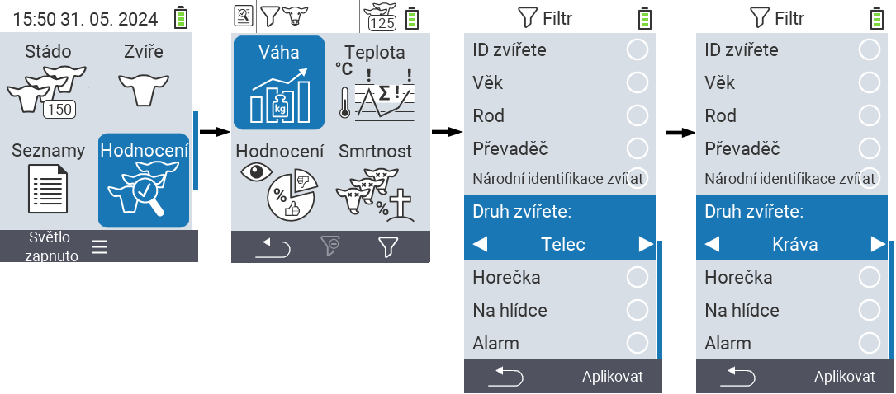
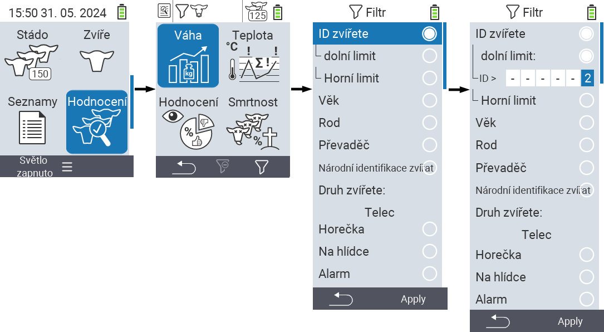
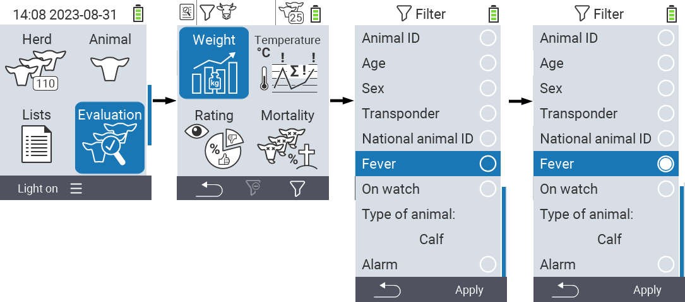

## Použití filtrů {#applying-filters}

{}
Filtr vám pomůže provést výběr pomocí kritérií filtru v položkách menu ``, `` a `` zařízení VitalControl. Jakmile použijete filtr, na horní části obrazovky se objeví symboly pro různá kritéria filtru. Tyto symboly vám pomohou zjistit, zda a která kritéria filtru jsou aktivována. Například pokud nastavíte filtr `` na mužské, zařízení bude používat pouze mužská zvířata. Pokud také aktivujete filtr ``, zařízení použije pouze mužská zvířata, která jsou na seznamu pozorování.
{}

Chcete-li vytvořit filtr v hodnoceních, postupujte následovně:

1. V podmenu patřícím k horní položce menu  `` stiskněte jednou klávesu `F3` . V podmenu patřícím k horním položkám menu  `` a  `` musíte stisknout klávesu dvakrát.

2. Otevře se podmenu, ve kterém můžete nastavit všechny možnosti filtru. Můžete filtrovat podle ``, ``, ``, ``, ``, ``, ``, `` a ``.

3. Pro filtry ``, ``, `` a `` přejděte do odpovídající oblasti a potvrďte ``. Pomocí šipek ◁ ▷ určete požadované nastavení. Použijte klávesu `F3` `` k uplatnění vybraného nastavení. Chcete-li zrušit změny filtru, stiskněte klávesu `F1` &nbsp;&nbsp;.

4. Pro filtry `` a `` vyberte odpovídající kritérium a potvrďte stisknutím ``. Nyní se vám zobrazí dolní a horní limit. Pomocí šipek △ ▽ přejděte na požadovaný limit a potvrďte stisknutím `` dvakrát. Nyní můžete nastavit požadované číslo pomocí šipek ◁ ▷ a šipek △ ▽. Jakmile jsou všechna nastavení správná, stiskněte znovu `` pro opuštění režimu nastavení a použijte vybraný filtr(y) pomocí klávesy `F3` ``. Pomocí klávesy `F1` &nbsp;&nbsp; můžete v případě potřeby zrušit své změny.

5. Pro filtry ``, `` a `` je možnost zakázat nebo povolit jejich použití. K tomu vyberte odpovídající filtr a potvrďte stisknutím ``. Filtr je nyní aktivní. Potvrďte znovu stisknutím `` pro deaktivaci filtru.

6. Jakmile nastavíte všechny filtry, použijte klávesu `F3` `` pro aplikaci definovaných filtrů nebo stiskněte klávesu `F1`  pro zrušení změn filtrů.
