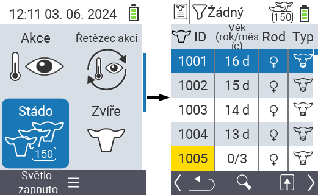
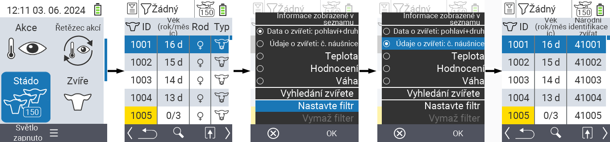
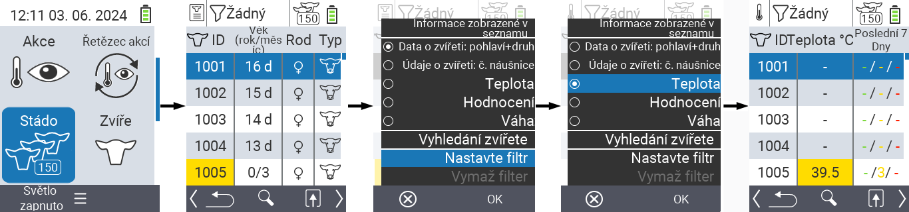
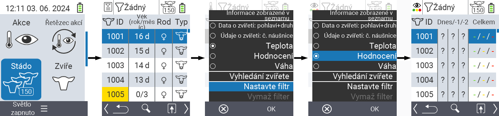
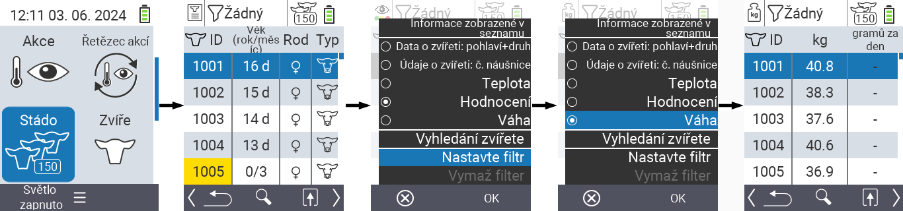
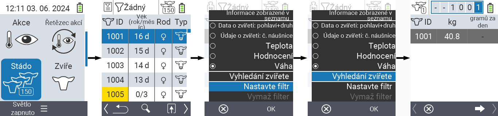
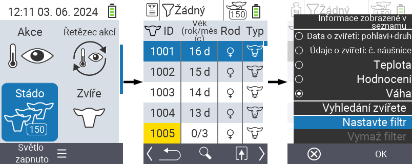
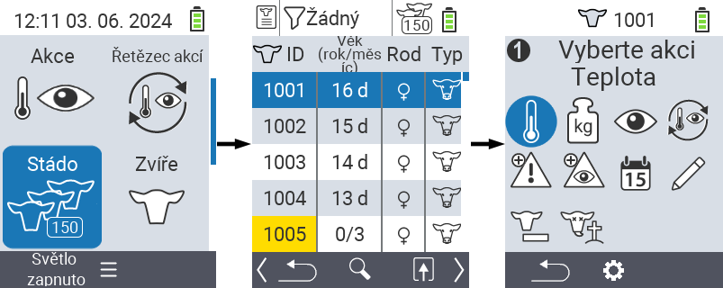

## Stádo {#herd}

V rámci položky menu Stádo můžete zobrazit celé své stádo, vyhledávat jednotlivá zvířata a zobrazovat důležité informace. Máte následující možnosti:

- Zobrazit [údaje o zvířatech](#view-animal-data)
- Zobrazit [údaje o teplotě](#display-temperature)
- Zobrazit [údaje o hodnocení](#view-rating)
- Zobrazit [údaje o hmotnosti](#display-weight)
- [Vyhledat zvíře](#search-animal)
- Nastavit [filtr](#set-filter)
- [Akce](#call-action-menu)

### Přípravné kroky {#preparatory-steps}

1. Na hlavní obrazovce vašeho zařízení VitalControl vyberte položku menu  `Stádo` a stiskněte tlačítko `OK`.

2. Otevře se přehled vašeho stáda.

    

### Zobrazit údaje o zvířatech {#view-animal-data}

1. Dokončete přípravné kroky.

2. Použijte klávesu `F3` &nbsp;&nbsp; k vyvolání popup menu, které uvádí kategorie informací, které lze zobrazit pro seznam stáda. Pomocí šipek △ ▽ zvýrazněte řádek `Údaje o zvířatech: pohlaví + typ` nebo `Údaje o zvířatech: N0 ušní známka` a vyberte tuto kategorii stisknutím centrálního tlačítka `OK` nebo klávesy `F3` `OK`. Tyto dvě možnosti výběru se liší v zobrazení informačního pruhu.

3. Údaje o zvířatech budou nyní zobrazeny jako obsah seznamu stáda.

4. Alternativně můžete použít šipky ◁ ▷ k přepínání mezi různými možnostmi zobrazení.

    

{}
Ve výchozím nastavení se nejprve zobrazují údaje o zvířatech. Pouze když máte například zobrazenou hmotnost, musíte znovu nastavit zobrazení údajů o zvířatech.
{}

### Zobrazit teplotu {#display-temperature}

1. Dokončete přípravné kroky.

2. Použijte klávesu `F3` &nbsp;&nbsp; k vyvolání vyskakovacího menu, které uvádí kategorie informací, které lze zobrazit pro seznam stáda. Použijte šipky △ ▽ k zvýraznění řádku `Teplota` a vyberte tuto kategorii stisknutím centrálního tlačítka `OK` nebo klávesy `F3` `OK`.

3. Data o teplotě budou nyní zobrazena jako obsah seznamu stáda.

4. Alternativně můžete použít šipky ◁ ▷ k přepínání mezi různými možnostmi zobrazení.

    

### Zobrazit hodnocení {#view-rating}

1. Dokončete přípravné kroky.

2. Použijte klávesu `F3` &nbsp;&nbsp; k vyvolání vyskakovacího menu, které uvádí kategorie informací, které lze zobrazit pro seznam stáda. Použijte šipky △ ▽ k zvýraznění řádku `Hodnocení` a vyberte tuto kategorii stisknutím centrálního tlačítka `OK` nebo klávesy `F3` `OK`.

3. Data o hodnocení budou nyní zobrazena jako obsah seznamu stáda.

4. Alternativně můžete použít šipky ◁ ▷ k přepínání mezi různými možnostmi zobrazení.

    

### Zobrazit hmotnost {#display-weight}

1. Dokončete přípravné kroky.

2. Použijte klávesu `F3` &nbsp;&nbsp; k vyvolání vyskakovacího menu, které uvádí kategorie informací, které lze zobrazit pro seznam stáda. Použijte šipky △ ▽ k zvýraznění řádku `Hmotnost` a vyberte tuto kategorii stisknutím centrálního tlačítka `OK` nebo klávesy `F3` `OK`.

3. Data o hmotnosti budou nyní zobrazena jako obsah seznamu stáda.

4. Alternativně můžete použít šipky ◁ ▷ k přepínání mezi různými možnostmi zobrazení.

    

### Vyhledat zvíře {#search-animal}
 
1. Dokončete přípravné kroky.

2. Použijte klávesu `F3` &nbsp;&nbsp; k vyvolání vyskakovacího menu, které uvádí různé možnosti. Použijte šipky △ ▽ k zvýraznění funkce `Vyhledat zvíře` a vyvolejte vyhledávací funkci stisknutím centrálního tlačítka `OK` nebo klávesy `F3` `OK`. Alternativně můžete použít tlačítko `Zap/Vyp`  ihned po kroku jedna.

3. Pomocí šipek △ ▽ ◁ ▷ zadejte požadované číslo zvířete a potvrďte stisknutím `OK`.

    

### Nastavit filtr {#set-filter}

1. Dokončete přípravné kroky.

2. Pomocí klávesy `F3` &nbsp;&nbsp; vyvolejte popup menu, které obsahuje různé možnosti. Pomocí šipek △ ▽ zvýrazněte funkci `Nastavit filtr` a vyvolejte funkci filtru stisknutím centrálního tlačítka `OK` nebo klávesy `F3` `OK`.

3. Jak aplikovat filtr naleznete [zde]().

    

### Vyvolat akční menu {#call-action-menu}

Vždy máte možnost vyvolat akční menu pro zvíře.

1. Dokončete přípravné kroky.

2. Vyberte zvíře ze seznamu pomocí šipek △ ▽ a potvrďte stisknutím `OK`.

3. Akční menu je nyní otevřeno. Jak jej použít naleznete [zde](../actions).

4. Návrat do seznamu stáda pomocí klávesy `F3`.

    
