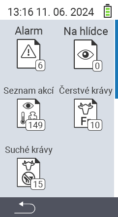

{}
Pokud kliknete na položku menu, budete přesměrováni na popis příslušné funkce.
{}

<map name="workmap">
  <area shape="rect" coords="3,40,116,160" alt="Seznam alarmů" title="Podívejte se na svůj seznam alarmů&#10;Kliknutí myší: otevřít dokumentaci" href="/cs/docs/lists/alarm/">
  <area shape="rect" coords="3,160,116,280" alt="Seznam akcí" title="Podívejte se na svůj seznam akcí&#10;Kliknutí myší: otevřít dokumentaci" href="/cs/docs/lists/actions/">
  <area shape="rect" coords="3,280,116,399" alt="Seznam suchých krav" title="Podívejte se na svůj seznam suchých krav&#10;Kliknutí myší: otevřít dokumentaci" href="/cs/docs/lists/dry-cows/">

  <area shape="rect" coords="116,40,230,160" alt="Seznam sledovaných" title="Podívejte se na svůj seznam sledovaných&#10;Kliknutí myší: otevřít dokumentaci" href="/cs/docs/lists/on-watch/">
  <area shape="rect" coords="116,160,230,280" alt="Čerstvé krávy" title="Podívejte se na svůj seznam čerstvých krav&#10;Kliknutí myší: otevřít dokumentaci" href="/cs/docs/lists/fresh-cows/">

  <area shape="rect" coords="2,401,115,438" alt="Zpět" title="Přeskočit o úroveň zpět" href="/cs/docs/menu/mainmenu/">
</map>
