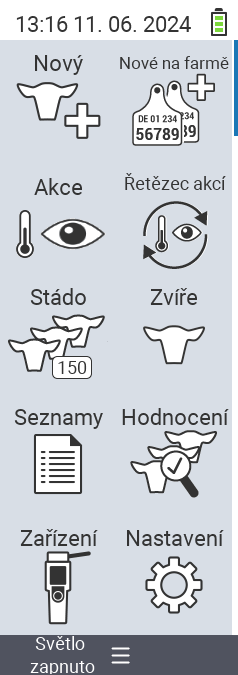

{}
Pokud kliknete na položku menu, budete přesměrováni na popis příslušné funkce.
{}

<map name="workmap">
  <area shape="rect" coords="3,40,116,160" alt="Nový" title="Vytvořit nová zvířata&#10;Kliknutí myší: otevřít dokumentaci" href="/cs/docs/new/">
  <area shape="rect" coords="3,160,116,280" alt="Akce" title="Akce na zvířatech&#10;Kliknutí myší: otevřít dokumentaci" href="/cs/docs/actions/">
  <area shape="rect" coords="3,280,116,400" alt="Stádo" title="Menu stáda&#10;Kliknutí myší: otevřít dokumentaci" href="/cs/docs/herd/">
  <area shape="rect" coords="3,400,116,520" alt="Seznamy" title="Seznamy zvířat&#10;Kliknutí myší: otevřít dokumentaci" href="/cs/docs/lists/">
  <area shape="rect" coords="3,520,116,634" alt="Zařízení" title="Zařízení&#10;Kliknutí myší: otevřít dokumentaci" href="/cs/docs/device/">

  <area shape="rect" coords="116,40,230,160" alt="Nový na farmě" title="Přístup zvířat&#10;Kliknutí myší: otevřít dokumentaci" href="/cs/docs/new-on-farm/">
  <area shape="rect" coords="116,160,230,280" alt="Řetězec akcí" title="Řetězec akcí&#10;Kliknutí myší: otevřít dokumentaci" href="/cs/docs/chain-of-actions/">
  <area shape="rect" coords="116,280,230,400" alt="Zvíře" title="Zvíře&#10;Kliknutí myší: otevřít dokumentaci" href="/cs/docs/animal/">
  <area shape="rect" coords="116,400,230,520" alt="Hodnocení" title="Hodnocení&#10;Kliknutí myší: otevřít dokumentaci" href="/cs/docs/evaluation/">
  <area shape="rect" coords="116,520,230,634" alt="Nastavení" title="Nastavení&#10;Kliknutí myší: otevřít dokumentaci" href="/cs/docs/settings/">
</map>
