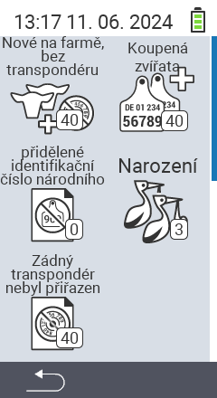

{}
Pokud kliknete na položku menu, budete přesměrováni na popis příslušné funkce.
{}

<map name="workmap">
  <area shape="rect" coords="3,40,116,160" alt="Nové na farmě, bez transpondéru" title="Zde přiřadíte transpondér novým zvířatům bez transpondéru&#10;Kliknutí myší: otevřít dokumentaci" href="/cs/docs/new-on-farm/new-no-transponder/">
  <area shape="rect" coords="3,160,116,280" alt="Není přiřazeno národní ID zvířete" title="Zde můžete zobrazit všechna zvířata, kterým ještě nebylo přiřazeno národní ID zvířete, a přiřadit jim národní ID zvířete&#10;Kliknutí myší: otevřít dokumentaci" href="/cs/docs/new-on-farm/no-national-animal-id-assigned/">
  <area shape="rect" coords="3,280,116,399" alt="Není přiřazen transpondér" title="Zde můžete zobrazit všechna zvířata, kterým ještě nebyl přiřazen transpondér, a přiřadit jim transpondér&#10;Kliknutí myší: otevřít dokumentaci" href="/cs/docs/new-on-farm/no-transponder-assigned/">

  <area shape="rect" coords="116,40,230,160" alt="Zakoupená zvířata" title="Zde můžete zobrazit své aktuální nákupy a exportovat data&#10;Kliknutí myší: otevřít dokumentaci" href="/cs/docs/new-on-farm/purchased-animals/">
  <area shape="rect" coords="116,160,230,280" alt="Porody" title="Zde můžete vidět své porody a vytvořit exportní soubor&#10;Kliknutí myší: otevřít dokumentaci" href="/cs/docs/new-on-farm/births/">
  <area shape="rect" coords="1,401,100,439" alt="Zpět" title="Přeskočit o úroveň zpět&#10;Kliknutí myší: do dokumentace" href="/cs/docs/menu/mainmenu/">
</map>
