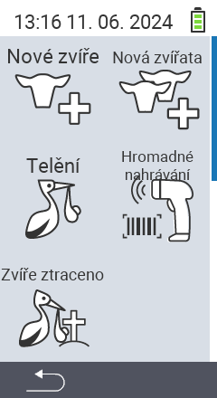

Přes hlavní položku menu  `` se dostanete do podmenu, kde je k výběru 5 podpoložek:

<map name="workmap">
  <area shape="rect" coords="3,40,116,160" alt="Nové zvíře" title="Jak registrovat nové zvíře pomocí zařízení VitalControl&#10;Kliknutí myší: otevřít dokumentaci" href="/cs/docs/new/animal/">
  <area shape="rect" coords="3,160,116,280" alt="Telení" title="Jak registrovat nové telení pomocí zařízení VitalControl&#10;Kliknutí myší: otevřít dokumentaci" href="/cs/docs/new/calving/">
  <area shape="rect" coords="3,280,116,399" alt="Ztráta zvířete" title="Jak registrovat ztrátu zvířete pomocí zařízení VitalControl&#10;Kliknutí myší: otevřít dokumentaci" href="/cs/docs/new/animal-loss/">

  <area shape="rect" coords="116,40,230,160" alt="Nová zvířata" title="Jak vytvořit více nových zvířat na zařízení VitalControl pomocí jedné akce&#10;Kliknutí myší: otevřít dokumentaci" href="/cs/docs/new/animals/">
  <area shape="rect" coords="116,160,230,280" alt="Hromadný záznam" title="Použijte čtečku čárových kódů k zaznamenání různých zvířat&#10;Kliknutí myší: otevřít dokumentaci" href="/cs/docs/new/bulk-recording/">

  <area shape="rect" coords="1,401,100,439" alt="Zpět" title="Vrátit se o úroveň zpět&#10;Kliknutí myší: do dokumentace" href="/cs/docs/menu/mainmenu/">
</map>

{}
Každé podmenu má svou vlastní ikonu. Přesuňte kurzor myši nad ikonu v grafice výše a nechte jej chvíli stát. Zobrazí se tooltip s informacemi o vybraném podmenu. Pokud kliknete na jednu z ikon, budete přesměrováni na popis vybrané položky podmenu.
{}
