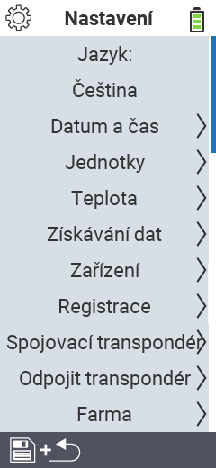

{}
Pokud kliknete na položku menu, budete přesměrováni na popis příslušné funkce.
{}

<map name="workmap">
  <area shape="rect" coords="2,40,230,120" alt="Jazyk" title="Nastavte a trvale uložte jazyk uživatelského rozhraní na vašem zařízení VitalControl&#10;Kliknutí myší: otevřít dokumentaci" href="/cs/docs/settings/language/">
  <area shape="rect" coords="2,120,230,160" alt="Datum a čas" title="Zde nastavíte datum a čas&#10;Kliknutí myší: otevřít dokumentaci" href="/cs/docs/settings/datetime/">
  <area shape="rect" coords="2,160,230,200" alt="Jednotky" title="Zde vyberete jednotky pro teplotu a hmotnost&#10;Kliknutí myší: otevřít dokumentaci" href="/cs/docs/settings/units/">
  <area shape="rect" coords="2,200,230,240" alt="Teplota" title="Nastavte teplotní nastavení pro aplikaci vašeho zařízení VitalControl&#10;Kliknutí myší: otevřít dokumentaci" href="/cs/docs/settings/temperature/">
   <area shape="rect" coords="2,240,230,280" alt="Sběr dat" title="Zde uložíte relevantní informace pro sběr dat o zvířatech&#10;Kliknutí myší: otevřít dokumentaci" href="/cs/docs/settings/data-acquisition/">
   <area shape="rect" coords="2,280,230,320" alt="Zařízení" title="Zde můžete upravit různá nastavení zařízení&#10;Kliknutí myší: otevřít dokumentaci" href="/cs/docs/settings/device/">
   <area shape="rect" coords="2,320,230,360" alt="Registrace zvířat" title="Zde můžete upravit několik továrně nastavených standardů týkajících se registrace nových zvířat podle požadavků vaší farmy.&#10;Kliknutí myší: otevřít dokumentaci" href="/cs/docs/settings/animal-registration/">
   <area shape="rect" coords="2,360,230,400" alt="Přiřazení transpondéru" title="Nastavte přiřazení transpondéru na vašem zařízení VitalControl&#10;Kliknutí myší: otevřít dokumentaci" href="/cs/docs/settings/transponder-linkage/">
   <area shape="rect" coords="2,400,230,439" alt="Odpojení transpondéru" title="Určete, jak bude přiřazeno ID zvířete po odpojení transpondéru&#10;Kliknutí myší: otevřít dokumentaci" href="/cs/docs/settings/transponder-linkage/">
   <area shape="rect" coords="2,440,230,480" alt="Farma" title="Trvale uložte své oficiální dvanáctimístné národní ID farmy na zařízení VitalControl&#10;Kliknutí myší: otevřít dokumentaci" href="/cs/docs/settings/farm-number/">
   <area shape="rect" coords="2,482,123,519" alt="Zpět" title="Přeskočit o úroveň zpět" href="/cs/docs/menu/mainmenu/">
</map>

