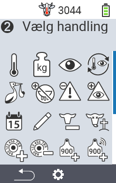
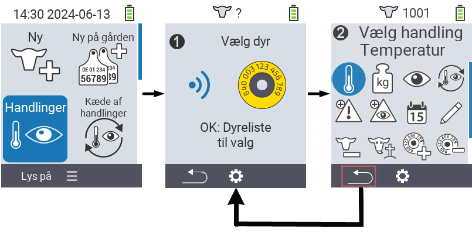
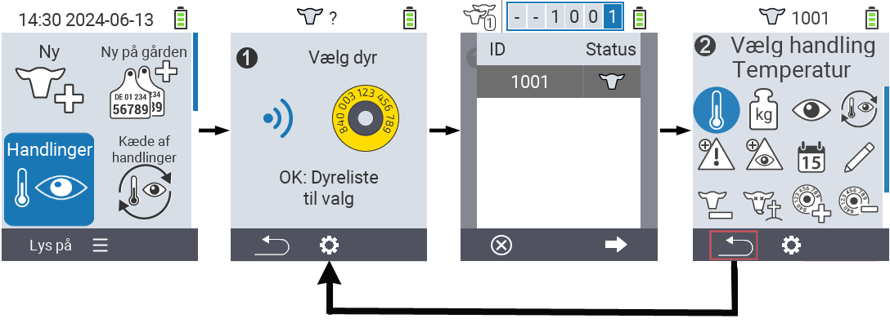

## Tilgængelige handlinger {#available-actions}

Afhængigt af dyretypen kan du udføre op til 16 forskellige handlinger for et dyr.

<map name="workmap">
  <area shape="rect" coords="3,100,60,165" alt="Temperatur" title="Mål feber hos dine dyr&#10;Museklik: åbn dokumentation" href="/en/docs/actions/measure-temperature/">
  <area shape="rect" coords="60,100,118,165" alt="Vejning" title="Registrer vægten af dine dyr&#10;Museklik: åbn dokumentation" href="/en/docs/actions/record-weight/">
  <area shape="rect" coords="118,100,174,165" alt="Bedømmelse" title="Bedøm dine dyr&#10;Museklik: åbn dokumentation" href="/en/docs/actions/rating/">
  <area shape="rect" coords="174,100,230,165" alt="Handlingskæde" title="Anvend og indstil handlingskæden&#10;Museklik: åbn dokumentation" href="/en/docs/chain-of-actions/">
   <area shape="rect" coords="3,165,60,225" alt="Kælvning" title="Registrer en kælvning&#10;Museklik: åbn dokumentation" href="/en/docs/actions/calving/">
   <area shape="rect" coords="60,165,120,225" alt="Goldning" title="Gold en ko eller tilføj hende til listen over friske køer&#10;Museklik: åbn dokumentation" href="/en/docs/actions/dry-off/">
   <area shape="rect" coords="120,165,175,225" alt="Alarm" title="Tilføj og fjern dyr fra alarmlisten&#10;Museklik: åbn dokumentation" href="/en/docs/actions/alarm/">
   <area shape="rect" coords="175,165,230,225" alt="Under observation" title="Sæt dyr på observationslisten eller fjern dem&#10;Museklik: åbn dokumentation" href="/en/docs/actions/on-watch/">
   <area shape="rect" coords="3,225,60,280" alt="Dyrehistorik" title="Se et dyrs historik&#10;Museklik: åbn dokumentation" href="/en/docs/actions/animal-history/">
   <area shape="rect" coords="60,225,120,280" alt="Rediger" title="Rediger data for det valgte dyr&#10;Museklik: åbn dokumentation" href="/en/docs/actions/edit/">
   <area shape="rect" coords="120,225,175,280" alt="Afregistrere" title="Afregistrere et dyr&#10;Museklik: åbn dokumentation" href="/en/docs/actions/unregister/">
   <area shape="rect" coords="175,225,230,280" alt="Dyretab" title="Registrer et dyretab&#10;Museklik: åbn dokumentation" href="/en/docs/actions/animal-loss/">
   <area shape="rect" coords="3,280,60,337" alt="Link transponder" title="Tildel en transponder til et dyr&#10;Museklik: åbn dokumentation" href="/en/docs/actions/link-transponder/">
   <area shape="rect" coords="55,280,120,337" alt="Fjern link til transponder" title="Fjern transponderlinket til et dyr&#10;Museklik: åbn dokumentation" href="/en/docs/actions/unlink-transponder/">
   <area shape="rect" coords="120,280,175,337" alt="Link dyre-ID manuelt" title="Tildel et nationalt dyre-ID til et dyr, der ikke har et nationalt dyre-ID&#10;Museklik: åbn dokumentation" href="/en/docs/actions/link-animal-id/#link-animal-id">
   <area shape="rect" coords="175,280,230,337" alt="Link dyre-ID med scanning" title="Tildel et nationalt dyre-ID til et dyr, der ikke har et nationalt dyre-ID&#10;Museklik: åbn dokumentation" href="/en/docs/actions/link-animal-id/#link-animal-id-with-electronic-ear-tag-scan">

   <area shape="rect" coords="100,340,140,375" alt="Indstillinger" title="Åbn indstillingerne&#10;Museklik: til dokumentationen" href="/en/docs/actions/setting/">
</map>

{}
Hver handling er identificeret ved et symbol. Flyt musemarkøren over et symbol i grafikken nedenfor og lad den hvile et øjeblik. En tooltip vises, som præsenterer information om den respektive handling. Hvis du klikker på et af symbolerne, vil du blive videresendt til en beskrivelse af den respektive handling.
{}

## Generel procedure {#general-procedure}

Inden for menuen   `` kan du til enhver tid vælge det næste dyr uden at skulle forlade menuen Handlinger. For at vælge det næste dyr, skal du gøre følgende:

1. Vælg menuen   `` på hovedskærmen på din VitalControl-enhed og tryk på `` knappen.

2. Enten scan et dyr ved hjælp af transponderen eller vælg et dyr fra listen. Bekræft ved at trykke på `` og vælg et dyr ved hjælp af piletasterne △ ▽. Bekræft med ``.

3. En undermenu åbnes, hvor du finder ikoner for adskillige dyrehandlinger. Brug piletasterne til at vælge den ønskede handling og start handlingen ved at trykke på `` knappen. Afhængigt af den valgte handling vil en eller flere skærme eller et pop-up vindue vises.

4. Hvis ønsket, kan du nu vælge og udføre en anden handling for det aktuelle dyr.

5. Efter du har udført den ønskede handling(er) for dyret, vend tilbage til trin 2 'Dyrevalg'. For at gøre dette, tryk på den venstre knap `F1` under ` symbolet i nederste venstre hjørne af foden.

6. Vinduet fra trin to åbnes igen automatisk, og du kan vælge det næste dyr eller vende tilbage til hovedmenuen ved at trykke på `F1` knappen under ` symbolet.



{}

{}
{}

{}


