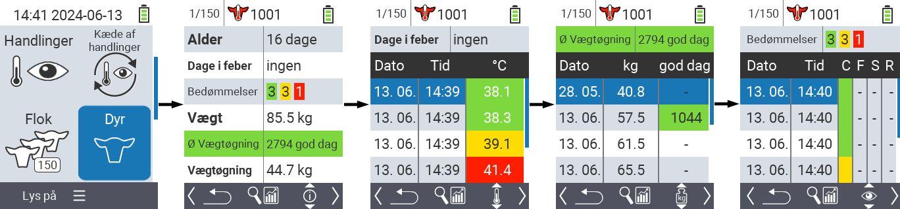
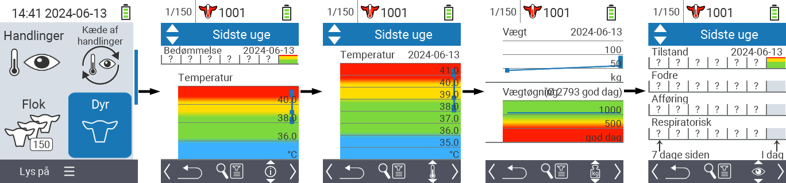
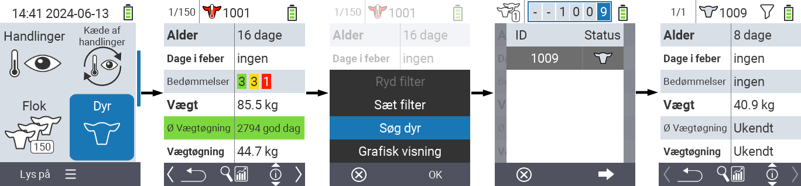
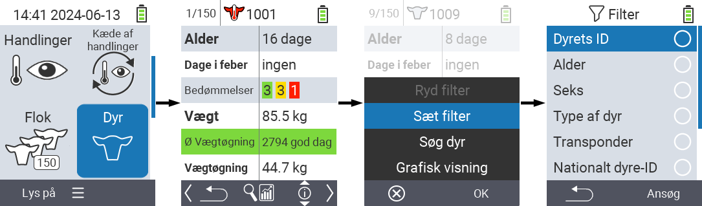

## Dyr {#animal}

Funktionen for individuelle dyr giver dig mulighed for at se vigtige oplysninger om vægt, temperatur og vurdering for hvert enkelt dyr. Du har altid mulighed for at vise oplysningerne som en grafik eller som en liste. For at bruge funktionen for enkelt dyr skal du gøre følgende:

1. På hovedskærmen på din VitalControl-enhed skal du vælge menupunktet  `` og trykke på `` knappen.

2. En oversigt over de vigtigste dyreoplysninger åbnes. Den øverste kant af skærmen viser dig, hvilket dyr du i øjeblikket ser. Brug `F3` tasten til at vælge mellem dyreoplysninger , temperatur , vægt  og vurdering .

{}
Inden for hver informationsvisning har du mulighed for at [søge efter et dyr](#search-animal), indstille et [filter](#set-filter) og skifte til en [grafisk visning](#set-graphical-view).
Du kan også skifte mellem de enkelte dyr når som helst ved hjælp af piletasterne ◁ ▷.
{}

### Indstil grafisk visning {#set-graphical-view}

1. Tryk på den midterste øverste `On/Off` knap  for at åbne en pop op-menu. I denne menu kan du vælge mellem funktionerne ``, ``, eller ``.

2. Vælg `` med piletasterne △ ▽ og bekræft med ``.

### Søg dyr {#search-animal}

1. Tryk på den midterste øverste `On/Off` knap  for at åbne en pop op menu. I denne menu kan du vælge mellem funktionerne ``, ``, eller ``.

2. Vælg `` med piletasterne △ ▽ og bekræft med ``.

3. Brug piletasterne △ ▽ ◁ ▷ til at vælge det ønskede dyrenummer og bekræft med ``

### Indstil filter {#set-filter}

1. Tryk på den midterste øverste `On/Off` knap  for at åbne en pop op menu. I denne menu kan du vælge mellem funktionerne ``, ``, eller ``.

2. Vælg `` med piletasterne △ ▽ og bekræft med ``.
Du kan få instruktioner om, hvordan du bruger filteret [her]().

