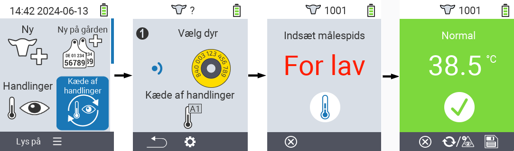
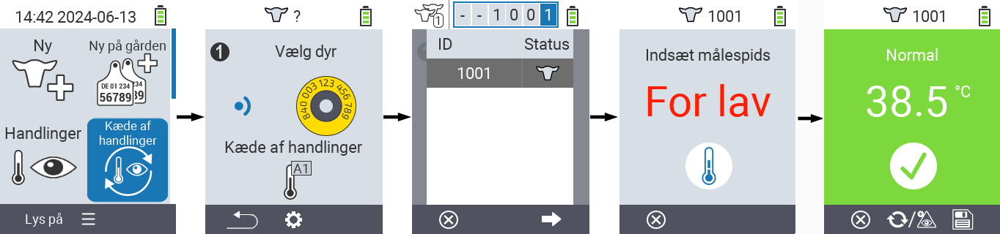
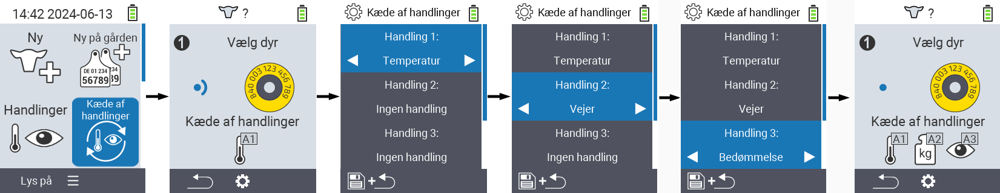

## Kæde af handlinger {#chain-of-actions}

Handlingskæden giver dig mulighed for automatisk at udføre flere handlinger for et dyr efter hinanden. For eksempel kan du vælge handlingerne `` og ``. Hvis du derefter udfører handlingskæden, kan du først tage dyrets temperatur og derefter registrere vurderingen umiddelbart efter.

### Brug kæde af handlinger {#use-chain-of-actions}

1. På hovedskærmen på din VitalControl-enhed skal du vælge menupunktet &nbsp;&nbsp; `` og trykke på `` knappen.

2. Enten scan et dyr ved hjælp af transponderen eller bekræft med `` og brug piletasterne △ ▽ ◁ ▷ til at indtaste det ønskede dyre-ID.

3. Handlingskæden udføres nu. Så snart alle handlinger i handlingskæden er udført, kan det næste dyr vælges direkte.



{}

{}
{}

{}


### Indstil kæde af handlinger {#set-chain-of-actions}

1. På hovedskærmen på din VitalControl-enhed skal du vælge menupunktet &nbsp;&nbsp; `` og trykke på `` knappen.

2. Brug knappen `F2` &nbsp;&nbsp; (``).

3. En overliggende skærm dukker op. Brug piletasterne △ ▽ til at vælge mellem de listede handlinger 1 - 4 (du kan udføre op til fire handlinger i træk). Brug piletasterne ◁ ▷ til at vælge den ønskede handling for den respektive handling. Gem indstillingerne med `F1`-tasten &nbsp;&nbsp;.

4. Hvis du vil nulstille hele handlingskæden, skal du vælge muligheden `` i undermenuen ved hjælp af piletasterne △ ▽ og bekræfte med ``.

    

{}
Inden for de enkelte handlinger har du de samme indstillingsmuligheder som beskrevet i kapitlet [Handlinger](../actions) for hver enkelt handling.
{}

{}
Symbolerne på startskærmen for handlingskæden viser, hvilke handlinger du har indstillet, og i hvilken rækkefølge.
{}

