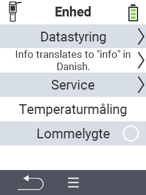

{}
Hvis du klikker på et menupunkt, bliver du omdirigeret til en beskrivelse af den respektive funktion.
{}

<map name="workmap">
  <area shape="rect" coords="2,40,238,80" alt="Datahåndtering" title="Kør datalagring, eksporter dine data og nulstil enheden&#10;Museklik: åbn dokumentation" href="/en/docs/device/data-management/">
  <area shape="rect" coords="2,80,238,120" alt="Info" title="Se vigtige software- og hardwareoplysninger&#10;Museklik: åbn dokumentation" href="/en/docs/device/info/">
  <area shape="rect" coords="2,120,238,160" alt="Service" title="Kontroller dine enhedsdrivere, opdater din firmware og udfør en række test&#10;Museklik: åbn dokumentation" href="/en/docs/device/service/">
  <area shape="rect" coords="2,160,238,200" alt="Temperaturmåling" title="Test din enheds temperaturmåling&#10;Museklik: åbn dokumentation" href="/en/docs/device/temperature-measurement/">
  <area shape="rect" coords="2,200,238,240" alt="Lommelygte" title="Tænd eller sluk lyset på din VitalControl-enhed&#10;Museklik: åbn dokumentation" href="/en/docs/device/flashlight/">

  <area shape="rect" coords="2,282,97,318" alt="Tilbage" title="Gå et niveau tilbage" href="/en/docs/menu/mainmenu/">
</map>
