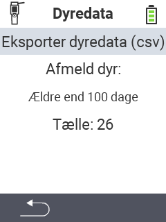

<map name="workmap">
  <area shape="rect" coords="2,40,238,80" alt="Eksporter dyredata (csv)" title="Eksporter dine dyredata&#10;Museklik: åbn dokumentation" href="/da/docs/data-export/usb-drive/">

  <area shape="rect" coords="2,80,238,200" alt="Afregistrer dyr" title="Angiv alderen, hvorfra dyr skal afregistreres&#10;Museklik: åbn dokumentation" href="/da/docs/device/data-management/animal-data/unregister-animal/">

  <area shape="rect" coords="2,282,120,319" alt="Tilbage" title="Al information og instruktioner til eksport af dyredata kan findes her&#10;Museklik: åbn dokumentation" href="/da/docs/device/data-management/">
</map>
