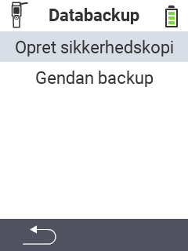

<map name="workmap">
  <area shape="rect" coords="2,40,238,80" alt="Create backup" title="Instruktionerne for at oprette en backup kan findes her&#10;Museklik: åbn dokumentation" href="/en/docs/backup/backup/">

  <area shape="rect" coords="2,80,238,120" alt="Restore backup" title="Instruktionerne for at gendanne en backup kan findes her&#10;Museklik: åbn dokumentation" href="/en/docs/backup/restore/">

  <area shape="rect" coords="2,282,120,319" alt="Back" title="Hop tilbage et niveau&#10;Museklik: åbn dokumentation" href="/en/docs/device/data-management/">
</map>
